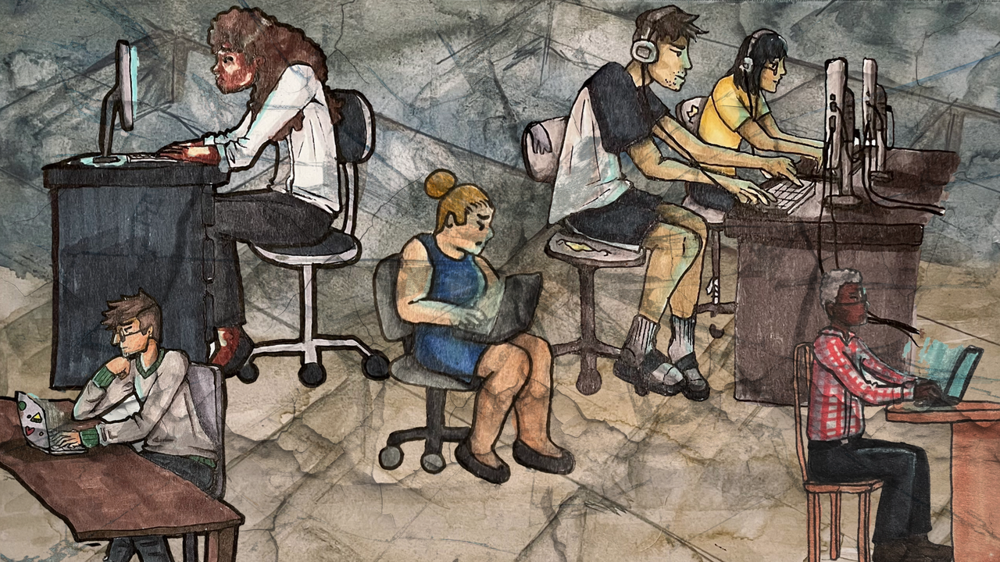

Language model developers are taking advantage of you for the benefit of the shareholders. 

{}
This post was adapted from an aside I wrote for <a href="https;//kairos.fm/intoaisafety/e023" target="_blank" rel="noreferrer noopener">Accelerating BlueDot's Impact w/ Li-Lian Ang</a>. I ended up cutting it out of the episode, as it really isn't what we were talking about; if you're really interested in the audio version, you can find it on the <a href="https://www.patreon.com/cw/Kairosfm" target="_blank" rel="noreferrer noopener">Patreon cut</a> of the episode.

Regardless, the reason I did the research was because I couldn't find a formalized version of this argument. Given that, I figured it would be a shame if I didn't share it more broadly. Then I did a bit more research...
{}

<figure>
    
    <figcaption style="font-size:small">Image by <a href="kathrynconrad.com" target="_blank" rel="noreferrer noopener">Kathryn Conrad</a> & <a href="https://digital-dialogues.co.uk/" target="_blank" rel="noreferrer noopener">Digit</a> / <a href="https://www.betterimagesofai.org" target="_blank" rel="noreferrer noopener">Better Images of AI</a> / <a href="https://betterimagesofai.org/images?artist=KathrynConrad&title=Isolation" target="_blank" rel="noreferrer noopener">Isolation</a> / <a href="https://creativecommons.org/licenses/by/4.0/" target="_blank" rel="noreferrer noopener">Licenced by CC-BY 4.0</a></figcaption>
</figure>

Let's start with the strong statement, and then I'll build up my argument a bit more:

_Companies developing language models (primarily user-facing chatbots) are subverting informed consent of their users. They can and should be held accountable._

## What is informed consent
To understand my perspective, we have to start with the concept of [informed consent](https://journals.lww.com/jmso/fulltext/2024/38010/importance_of_informed_consent_in_medical_practice.1.aspx) and its role in healthcare.[^1] Basically, it's a core principle in medical practice, and requires that the healthcare professional ensure the patient is fully aware of and agrees to the treatments being proposed.

Getting a bit more specific, that means the patient needs to have:
* Sufficient information about...
  * the nature of the treatment
  * potential outcomes, and consequences
  * alternative interventions and their risks and benefits
* The ability to understanding this information
* The competency to make the decision accounting for that understanding

For a number of reasons, there are very few people who can easily demonstrate informed consent when it comes to the use of LLMs for mental health.

## How chatbots steal your trust

Big Tech’s anthropomorphization of “AI” has distorted the understanding of these systems. It has been well [established](https://www.sciencedirect.com/science/article/abs/pii/S0747563222003338) that even subtle cues in social terms can have significant impacts on how humans interact with a computer system. This evolutionarily gained trait is being leveraged [against us](https://onlinelibrary.wiley.com/doi/10.1111/japp.70008?af=R); for example, simply making the interface with which we use chatbots mimic direct-messaging implies that the system is more human-like than it actually is. More egregiously, developers are baking personas into their LLMs,[^2] thoroughly "[human-washing](https://link.springer.com/article/10.1007/s00146-022-01492-1)" their products, a term introduced in an article from _AI and Society_.

These practices lead to unearned trust and asymmetric relationships with a tool that is [controlled](https://www.abc.net.au/news/science/2023-03-01/replika-users-fell-in-love-with-their-ai-chatbot-companion/102028196) and developed by a profit-maximizing third party. As a result, many LLM users do not have an accurate understanding of the limitations that these systems have, or the [risks](https://link.springer.com/article/10.1007/s00146-025-02318-6) that they pose.

## Don't worry, it's for "wellness"

While I truly don't understand how the likes of chatbot companion apps like Character.AI and Replika have gotten away with their behavior for this long, the largest developers aren't by any means innocent.

Big Tech is [pushing](https://opentools.ai/news/panasonic-and-anthropic-team-up-for-ai-powered-family-wellness-revolution) the use of their systems for "wellness," which includes discussions of stress, habits, and other aspects of daily life.[^3] Importantly, the fineprint in their Use Agreements take very explicit care to note that using the models for healthcare is not condoned.[^4] This exploits a [shortcoming](https://blogs.depaul.edu/jhli/2025/04/10/legal-loophole-of-health-apps-by-samra-saleem/) of current legislation, which was not designed to account for the chatbots of today. Because of the wording used, the _user_ is made accountable for knowing when they are using the system in an acceptable way for “wellness” or an unacceptable way for mental health. This allows the companies to avoid the more rigorous regulations applied to mental health software regarding aspects like privacy and data security.

But the line between "wellness" and mental health support is extremely thin, dependent on extensive context, and requires clinical expertise, not to mention the fact that mental health professionals have been [outspoken](https://health.clevelandclinic.org/dangers-of-self-diagnosis) against self-diagnosis of conditions.[^5] Together, these factors place an unreasonable burden on users and intentionally subvert informed consent.

Regardless of what developers put in their Use Agreements, the fact is that tens of millions of American adults are _currently_ using chatbots and language model based technology for mental health support.[^6] In a recent [preprint](https://osf.io/preprints/osf/ygx5q_v1) "Current Real-World Use of Large Language Models for Mental Health," Stade et al. approximate this number to be 13-17 million Americans adults, but that number has grown since their survey. Additionally, their count doesn't include teens, who are traditionally quicker to adopt new technologies.

So, while model developers hide behind Use Agreements, their intentionally ill-defined technology is undeniably being used for mental health support.

## One way to solve the problem

Here's the thing, this isn't a difficult problem to solve. We can address a very significant portion of this problem _right now_ with known technical solutions similar to those that have been implemented to prevent chatbots from saying the names of certain [specific individuals](https://www.theatlantic.com/technology/archive/2024/12/chatgpt-wont-say-my-name/681028/). Doing so would require a coarse filter that stops conversations whenever they vear too close towards _potentially_ problematic.

However, as mentioned previously, whether or not a chat response is indicative of a concerning mental health problem is not trivial; depending on the patient and context, two chat conversations could be seen as harmless or extremely concerning. As a result, Big Tech would massively reduce the space of conversations that could be had with their systems if they were to implement such an approach. They simply won't do this, because it will hurt their bottom line.

The simplest solution, in my opinion, is to create meaningful liability for model developers when their intentionally ill-defined systems are used for mental health. Similarly to the [scramble](https://futurism.com/openai-forensic-psychiatrist) we've recently seen OpenAI conducting in an attempt to calm this brewing storm, we would see a massive shift in the priorities of these companies.

## The mental health crisis

To be clear, the rapid adoption of language models for consumer mental health support indicates a massive problem with our current society and how we treat mental health. People use these systems in place of proven interventions due to difficulties of [access](https://www.npr.org/sections/shots-health-news/2025/09/30/nx-s1-5557278/ai-artificial-intelligence-mental-health-therapy-chatgpt-openai) and issues with societal stigma. There are specific [applications](https://ui.adsabs.harvard.edu/abs/2025arXiv250110374M/abstract) of language models which are quite promising for making mental health care much easier to come by; however, these technologies must be investigated ethically before they are deployed en masse. As it stands right now, we are all living in a clinical trial with no ethical oversight.

### Extra Links

If you're interested on reading up about these topics, here are some of the articles which I found most helpful when conducting my research (but weren't already linked above):

* [The Chatbot Trap](https://www.ignorance.ai/p/the-chatbot-trap)
* [ChatGPT Sycophantic Tone: How Humanizing Chatbots Pose Risks](https://www.medianama.com/2025/04/223-chatgpt-sycophantic-tone-risks-humanizing-ai-chatbots/)
* [Humanlike chatbots detract from developing AI for the human good](https://news.westernu.ca/2025/08/danger-of-anthropomorphic-ai/)
* [4 reasons not to turn ChatGPT into your therapist](https://www.brightfama.com/blog/2025/08/28/4-reasons-not-to-turn-chatgpt-into-your-therapist/)
* [Large language models cannot replace mental health professionals](https://makingnoiseandhearingthings.com/2022/08/03/large-language-models-cannot-replace-mental-health-professionals/)

[^1]: For a perspective on informed consent which is tailored to mental healthcare and psychiatry specifically, check out this [article](https://pmc.ncbi.nlm.nih.gov/articles/PMC7055160/) from the Indian Journal of Medical Research.

[^2]: Although the more concerning cases are those like Character.AI and Replika, the process of Reinforcement Learning through Human Feedback (RLHF) _necessarily_ does this as well. Igor and I get into this more on [this](https://kairos.fm/muckraikers/e017/) episode of muckrAIkers.

[^3]: Found and app called "[AI Listener: Your Emotional Guide](https://www.meta.com/experiences/ai-listener-your-emotional-guide/7182773695092320/?srsltid=AfmBOop9-JHpjv75EJGP_GqaIOyjDqPpCki-S7_Kv2xU5SsvhHRH-s_0)" on Meta's marketplace while researching... truly horrifying.

[^4]: For example, a recent update to Anthropic's [Use Agreement](https://www.anthropic.com/legal/aup) (from September 15th, 2025) states "Use cases related to healthcare decisions, medical diagnosis, patient care, therapy, mental health, or other medical guidance [are prohibited]. Wellness advice (e.g., advice on sleep, stress, nutrition, exercise, etc.) does not fall under this category." Similarly, [OpenAI's](https://openai.com/policies/service-terms/) reads "Our Services are not intended for use in the diagnosis or treatment of any health condition. You are responsible for complying with applicable laws for any use of our Services in a medical or healthcare context."

[^5]: Not to mention the [evidence](https://pubmed.ncbi.nlm.nih.gov/38471511/); while not unilaterally negative, self-diagnosis comes with significant risks and can make the jobs of healthcare professionals much more difficult.

[^6]: I only make a claim about American adults because that's the best data I know of. This problem is by no means isolated to the United States.

