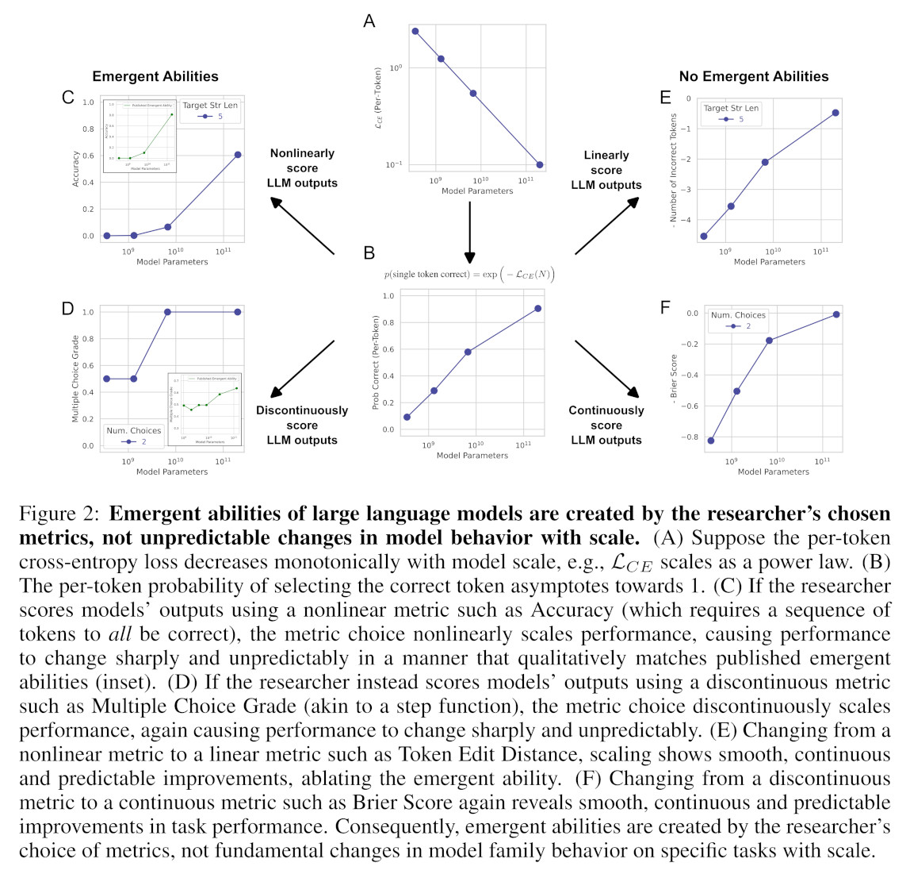

*This is a linkpost for [https://www.odysseaninstitute.org/post/let-s-talk-about-emergence](https://www.odysseaninstitute.org/post/let-s-talk-about-emergence)*

<figure>
    
    <figcaption style="font-size:small">Image by Clarote & <a href="https://www.ai4media.eu/" target="_blank" rel="noreferrer noopener">AI4Media</a> / <a href="https://www.betterimagesofai.org" target="_blank" rel="noreferrer noopener">Better Images of AI</a> / Power/Profit / <a href="https://creativecommons.org/licenses/by/4.0/" target="_blank" rel="noreferrer noopener">Licenced by CC-BY 4.0</a></figcaption>
</figure>

The field of machine learning has existed for many decades, but only recently have governments become actively concerned about the technologies leveraging its most advanced techniques. For a majority of people, this can be traced to the launch of ChatGPT, when we entered an era of so-called Large Language Models, or LLMs. One reasonable question, then, is what made ChatGPT dissimilar to its predecessors?

One distinction that has been proposed as a key differentiation between LLMs, and their smaller counterpart, Language Models, is that LLMs exhibit Emergence, or equivalently, that some of their capabilities have been categorized as **Emergent**[1]. It is important to note that, in this context, the root **Emerge** is being used as a keyword specific to the domain of machine learning, and not for its other definitions. Although the nuances of the definition differ between publications, the root **Emerge** is frequently reduced to some variation of the definition given by Wei et al.: “An ability is **[E]mergent** if it is not present in smaller models but is present in larger models.”[2] Although this meaning does result in circular reasoning when taken in conjunction with the description of LLMs proposed by domain experts in “Large Language Models: A Survey,” it is the one that has been largely accepted within machine learning circles, so we will use it as the basis for our understanding within this article[1,3,4,5]. The term’s meaning, as a keyword in the field of machine learning, is obfuscated by a number of factors, which we will explore in this article.

**Emergence** has been referenced in many works as a salient threat vector that could cause significant harm if ignored; a prominent paper from GovAI titled “Open Sourcing Highly Capable Foundation Models: An evaluation of risks, benefits, and alternative methods for pursuing open-source objectives” highlighted **Emergence** as a reason to refrain from Open Source practices, and a relatively recent paper titled “Sleeper Agents: Training Deceptive LLMs that Persist Through Safety Training” recognized **Emergent** deception as a threat vector salient enough to warrant a massive research effort and modification of current state-of-the-art techniques[3,4]. Perhaps most crucially, policymakers are beginning to cite **Emergence** as a motivating factor as well, as is seen in a letter from the House Committee on Science, Space, and Technology to the director of the National Institute of Standards and Technology[5,6].

Seeing as this trait played a significant role in the shift of attitude and rhetoric surrounding cutting edge machine learning systems, and as **Emergence** continues to be used as a critical source of danger surrounding the deployment of LLMs, let’s take a closer look at the term, what it means, and how it is being used.[^1]

{}
As this article is fundamentally concerned with the importance of the meaning of words, it is particularly relevant to clarify what the root word emerge could reasonably mean or refer to. 

First, we have the dictionary definition of the term: “the fact of something becoming known or starting to exist”[7]. This is primarily notable due to the fact that *many* academic papers will use the root word *emerge* in this context, e.g. stating that a capability *has emerged*, that a behavior *emerges* due to certain external factors, or that they note the *emergence* of a property. One recognizable example of the word being used in this manner is given by Georgetown’s Center for Security and Emerging Technology (CSET). 

In addition to this standard definition, *emerge* has also been a domain-specific keyword in the study of complex systems since 1875, when philosopher G. H. Lewes coined the term[8,9]. In the words of a recent blogpost from CSET, emergence, in this context, “describes systems that cannot be explained simply by looking at their parts, such as complex social networks.”[6] The most intuitive examples can be observed in nature through collective behavior of animals, such as flocking of birds, schooling of fish, and many behaviors within colonies of ants, bees, and termites. Other domains, such as game theory, nonlinear dynamics, and pattern formation also utilize this definition of the term. As a final note, systems theory would categorize *all* language models as systems which exhibit *emergence*, regardless of their size. 

More recently, the field of machine learning has been utilizing **Emergence** to describe a new concept which is related to, but not the same as, the previous keyword. Although the precise definition has resisted consensus, all hint towards the framing described by Wei et al. The perspectives utilized by notable papers in the field of machine learning, as well as the original context from G. H. Lewes “Problems of Life and Mind,” can be seen in Table 1. 

In order to promote clarity, the term **Emergence**, when used as a keyword specific to the domain of machine learning, will always be capitalized and bolded.
{}

The current concept of **Emergence** in the field of machine learning can be traced to the paper “Unsolved Problems in ML Safety,” which was released in September of 2021[10]. In it, Hendrycks et al. make the case that “[Machine learning systems] frequently demonstrate properties of self-organizing systems such as spontaneously **[E]mergent** capabilities,” citing two additional papers, “Language Models are Few Shot Learners,” and “Emerging Properties in Self-Supervised Vision Transformers”[11,12]. It is important to note that neither paper discussed their findings from this perspective; it was a conclusion reached by the team writing “Unsolved Problems in ML Safety.”[^2] Hendrycks et al. use the unpredictability of **Emergence** as a significant motivator in their call for increased efforts towards ensuring that advanced machine learning systems are safe.

Beginning in early 2022 with Jacob Steinhardt’s blog post “Future ML Systems Will Be Qualitatively Different,” the concept has been presented many times; prominent definitions of **Emergence**, with regards to machine learning systems, are chronicled in Table 1[13].

*NOTE: The table doesn't render super well here, so check it out on the original post.*

Perhaps most importantly, Bommasani et al. make the claim that in-context learning[^3] is an **Emergent** property[14]. This is based on the assertion that GPT-3, with 175 billion parameters, exhibits in-context learning, while GPT-2, with 1.5 billion parameters, does not. Lu et al. refute this claim, stating that “...in-context learning can be used in performing any task through the inclusion of a few illustrative examples within the prompt. We note that this contrasts with the notion of **[E]mergent** abilities, which are implied to occur due to LLMs’ capacity to perform above the random baseline on the corresponding tasks without explicit training on that task.”[18]

Schaeffer et al. also provide compelling evidence that Emergence is wholly dependent on the researcher's choice of metrics, which is visualized in Figure 2 of their paper. In essence, when a metric that can change abruptly is used, the resulting plots indicate **Emergence**; contrarily, when more smooth metrics are used, the notion of **Emergence** vanishes.[17]

<figure>
    
    <figcaption style="font-size:small">Image by <a href="https://arxiv.org/abs/2304.15004" target="_blank" rel="noreferrer noopener">Schaeffer et al.</a> / Figure 2 / <a href="https://creativecommons.org/licenses/by-nc-nd/4.0/" target="_blank" rel="noreferrer noopener">Licenced by CC-BY-NC-ND 4.0</a></figcaption>
</figure>

These two papers provide an important critique of the narrative surrounding certain risks that advanced machine learning systems pose, indicating that the definition of **Emergence** as a keyword in the field of machine learning is still being worked out, and determining the properties which can be considered **Emergent** is currently an active area of research.

---

As someone with experience in research, machine learning, and education, I would argue that we probably shouldn’t have used the term **Emergence** in the first place. The root emerge is already widely used in academic articles, including in papers within the domain of machine learning; when combined with the fact that the disparate definitions of the term are related[^4], it quickly becomes difficult to parse its intended meaning.[^5] Finally, the concept of emergence in the study of complex systems has been described as inherently subjective, meaning that, depending on the circumstances of analysis, different conclusions may be reached[20].[^6] In any scenario where a developing technology is going to have substantial effects on society, every effort should be made to remove potential sources of confusion or misunderstanding.

The imprecision of researchers has a meaningful effect on scientific rigor, which can be explicitly seen in this example by the circular definition that has developed between LLMs and **Emergence**. In turn, the understanding of these advanced machine learning technologies is undermined, making deliberation and democratic decision-making more time consuming and complicated. By using terminology that is inaccurate, unclear, and/or sensationalistic, researchers are actively making forward progress more difficult.

That being said, dismissing the concept of **Emergence** in machine learning, as it has been put forth, results in missing two very important elements of this story. The first, which was also noted by Steinhardt in his blog post, is a concept referred to as the phase transition[13]. Although I won’t go into too much detail here, phase transitions can be thought of as changes in system behavior which are relatively quick or sharp. There is a robust selection of literature on the study of phase transitions in machine learning, and it is still an active area of research[21,22]. Importantly, the larger increases to the inputs of machine learning systems are, the more likely it is that phase transitions will occur.

The second piece that we shouldn’t throw out with the bathwater is that we *were surprised by something*. Perhaps it was the impact that exponential scaling of parameter count and data would have on model performance, perhaps it was the progress that could be made without any innovation being applied to the underlying transformer architecture that powers the majority of today’s cutting edge machine learning systems, or maybe it was something else entirely. To me, all of this is indicative not of **Emergent** properties that couldn’t have been documented and addressed before creating the models, but of negligence from the companies pulling the strings.

## Acknowledgements

I would like to thank [Igor Krawczuk](https://krawczuk.eu/) for review, and critique of this post, as well as discussion on the topic. I also greatly appreciate Giuseppe Dal Pra, Isabel Johnson, Chris Chan, and Bilal Ashghar for their assistance.

## References

[1] S. Minaee et al., “Large Language Models: A Survey.” arXiv, Feb. 09, 2024. doi: 10.48550/arXiv.2402.06196.

[2] J. Wei et al., “Emergent Abilities of Large Language Models.” arXiv, Oct. 26, 2022. doi: 10.48550/arXiv.2206.07682.

[3] E. Seger et al., “Open-Sourcing Highly Capable Foundation Models: An evaluation of risks, benefits, and alternative methods for pursuing open-source objectives.” arXiv, Sep. 29, 2023. doi: 10.48550/arXiv.2311.09227.

[4] E. Hubinger et al., “Sleeper Agents: Training Deceptive LLMs that Persist Through Safety Training.” arXiv, Jan. 17, 2024. doi: 10.48550/arXiv.2401.05566.

[5] Frank Lucas, Zoe Lofgren, Mike Collins, Haley Stevens, Jay Olbernolte, and Valerie Foushee, “Letter to Dr. Laurie Locascio,” Dec. 14, 2023. Available: https://republicans-science.house.gov/_cache/files/8/a/8a9f893d-858a-419f-9904-52163f22be71/191E586AF744B32E6831A248CD7F4D41.2023-12-14-aisi-scientific-merit-final-signed.pdf

[6] S. Fitch, “Emergent Abilities in Large Language Models: An Explainer,” Center for Security and Emerging Technology. Available: https://cset.georgetown.edu/article/emergent-abilities-in-large-language-models-an-explainer/

[7] “emergence.” Available: https://dictionary.cambridge.org/us/dictionary/english/emergence

[8] G. H. Lewes, Problems of Life and Mind: The principles of certitude. From the known to the unknown. Matter and force. Force and cause. The absolute in the correlations of feeling and motion. Appendix: Imaginary geometry and the truth of axioms. Lagrange and Hegel: the speculative method. Action at a distance. Osgood, 1875.

[9] “Emergence,” Wikipedia. Apr. 28, 2024. Available: https://en.wikipedia.org/w/index.php?title=Emergence&oldid=1221163474

[10] D. Hendrycks, N. Carlini, J. Schulman, and J. Steinhardt, “Unsolved Problems in ML Safety,” ArXiv, Sep. 2021, Available: https://www.semanticscholar.org/paper/Unsolved-Problems-in-ML-Safety-Hendrycks-Carlini/05c2e1ee203be217f100d2da05bdcc52004f00b6?sort=is-influential

[11] T. B. Brown et al., “Language Models are Few-Shot Learners.” arXiv, Jul. 22, 2020. Available: http://arxiv.org/abs/2005.14165

[12] M. Caron et al., “Emerging Properties in Self-Supervised Vision Transformers,” 2021 IEEECVF Int. Conf. Comput. Vis. ICCV, pp. 9630–9640, Oct. 2021, doi: 10.1109/ICCV48922.2021.00951.

[13] “Future ML Systems Will Be Qualitatively Different,” Bounded Regret. Available: https://bounded-regret.ghost.io/future-ml-systems-will-be-qualitatively-different/

[14] R. Bommasani et al., “On the Opportunities and Risks of Foundation Models.” arXiv, Jul. 12, 2022. doi: 10.48550/arXiv.2108.07258.

[15] P. W. Anderson, “More Is Different,” Science, vol. 177, no. 4047, pp. 393–396, Aug. 1972, doi: 10.1126/science.177.4047.393.

[16] A. Srivastava et al., “Beyond the Imitation Game: Quantifying and extrapolating the capabilities of language models.” arXiv, Jun. 12, 2023. doi: 10.48550/arXiv.2206.04615.

[17] R. Schaeffer, B. Miranda, and S. Koyejo, “Are Emergent Abilities of Large Language Models a Mirage?” arXiv, May 22, 2023. doi: 10.48550/arXiv.2304.15004.

[18] S. Lu, I. Bigoulaeva, R. Sachdeva, H. T. Madabushi, and I. Gurevych, “Are Emergent Abilities in Large Language Models just In-Context Learning?” arXiv, Sep. 04, 2023. doi: 10.48550/arXiv.2309.01809.

[19] S. Bubeck et al., “Sparks of Artificial General Intelligence: Early experiments with GPT-4.” arXiv, Apr. 13, 2023. doi: 10.48550/arXiv.2303.12712.

[20] “The Calculi of Emergence: Computation, Dynamics, and Induction.” Available: https://csc.ucdavis.edu/~cmg/compmech/pubs/CalcEmergTitlePage.htm

[21] L. Saitta and M. Sebag, “Phase Transitions in Machine Learning,” in Encyclopedia of Machine Learning, C. Sammut and G. I. Webb, Eds., Boston, MA: Springer US, 2010, pp. 767–773. doi: 10.1007/978-0-387-30164-8_635.

[22] H. Cui, F. Behrens, F. Krzakala, and L. Zdeborová, “A phase transition between positional and semantic learning in a solvable model of dot-product attention.” arXiv, Feb. 06, 2024. doi: 10.48550/arXiv.2402.03902.

[^1]: It is worth noting that CSET recently published a blog post titled “[Emergent Abilities in Large Language Models: An Explainer](https://cset.georgetown.edu/article/emergent-abilities-in-large-language-models-an-explainer/),” which covers virtually the same topic as this one, from a different perspective. If you are curious about the idea of emergence or **Emergence**, it is definitely worth checking out[5].

[^2]: “Emerging Properties in Self-Supervised Vision Transformers” only uses the word emergence for its true definition, not a domain specific keyword, and “Language Models are Few-Shot Learners” contains no instance of the letter combination ‘emerge’ at all.

[^3]: In-context learning is a phenomenon exhibited by LLMs (by definition). A model exhibits in-context learning if its performance on a task can improve after being provided some number of examples within the same prompt.

[^4]: Relatedly, emergence, as it is used within the study of complex systems, is already an intricate idea, and I would argue that it is not necessarily wholly unrelated to the current characterization of machine learning Emergence.

[^5]: A set of illustrative examples  - citations are removed  • “Transformers have recently emerged as an alternative to convolutional neural networks (convnets) for visual recognition.”[14]  • “However, the good performance with k-NN only emerge when combining certain components such as momentum encoder and multi-crop augmentation.” [14]  • “We note that the emergence of human-level abilities in these domains has recently been observed with the latest generation of LLMs…” [19]  • “Beyond the potential value derived via new powers, we need to consider the potential costs and rough edges associated with the emerging technology…” [19]

[^6]: “Defining structure and detecting the emergence of complexity in nature are inherently subjective, though essential, scientific activities. Despite the difficulties, these problems can be analysed in terms of how model-building observers infer from measurements the computational capabilities embedded in non-linear processes. An observer’s notion of what is ordered, what is random, and what is complex in its environment depends directly on its computational resources: the amount of raw measurement data, of memory, and of time available for estimation and inference. The discovery of structure in an environment depends more critically and subtly, though, on how those resources are organized. The descriptive power of the observer’s chosen (or implicit) computational model class, for example, can be an overwhelming determinant in finding regularity in data.”