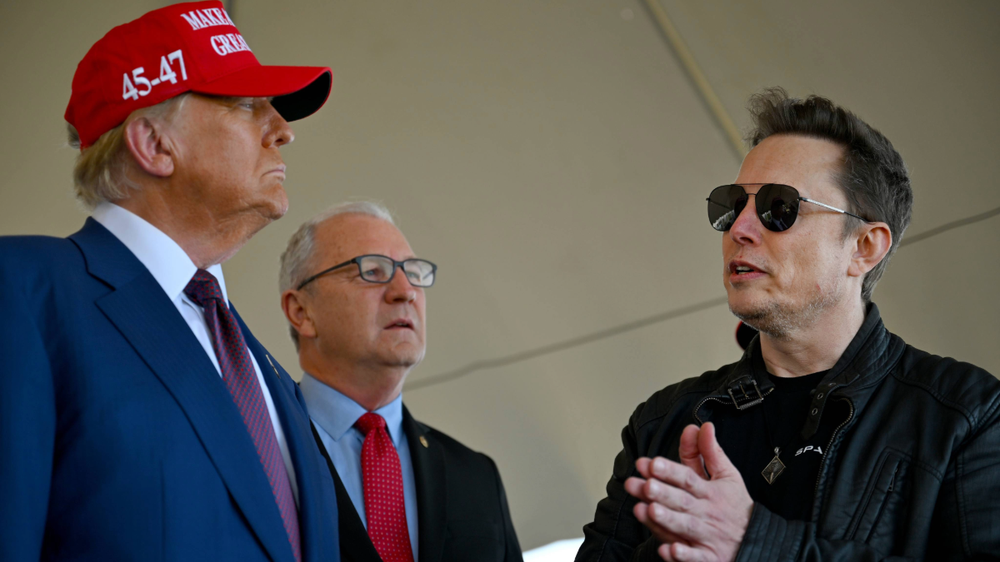

This is a linkpost for <a href="https://www.techpolicy.press/navigating-trumps-ai-strategy-a-roadmap-for-international-ai-safety-institutes/" target="_blank" rel="noreferrer noopener">https://www.techpolicy.press/navigating-trumps-ai-strategy-a-roadmap-for-international-ai-safety-institutes/
</a>

<figure>
    
    <figcaption style="font-size:small">
    Photo by 
    Brandon Bell / Getty Images / 
    BROWNSVILLE, TEXAS - NOVEMBER 19, 2024: US President-elect Donald Trump speaks alongside Elon Musk (R) and Senate members including Sen. Kevin Cramer (R-ND (C) before attending a viewing of the launch of the sixth test flight of the SpaceX Starship rocket)</figcaption>
</figure>

As the Biden administration prepares to <a href="https://www.commerce.gov/news/press-releases/2024/09/us-secretary-commerce-raimondo-and-us-secretary-state-blinken-announce" target="_blank" rel="noopener">host</a> the International Network of AI Safety Institutes (IN AISI) for its first meeting this week in San Francisco, uncertainty looms over the gathering. Just two weeks after Donald Trump was elected to return to the White House, the network – <a href="https://www.nist.gov/news-events/news/2024/05/us-secretary-commerce-gina-raimondo-releases-strategic-vision-ai-safety" target="_blank" rel="noopener">founded</a> earlier this year by US Commerce Secretary Gina Raimondo – grapples with questions about its direction and sustainability under a leader who <a href="https://www.techpolicy.press/one-year-into-bidens-ai-order-will-a-new-president-change-course/" target="_blank" rel="noopener">promised</a> to revoke the Biden <a href="https://www.whitehouse.gov/briefing-room/presidential-actions/2023/10/30/executive-order-on-the-safe-secure-and-trustworthy-development-and-use-of-artificial-intelligence/" target="_blank" rel="noopener">AI Executive Order</a> that created the <a href="https://www.nist.gov/aisi" target="_blank" rel="noopener">US AI Safety Institute</a>.

With the global proliferation of artificial intelligence, the IN AISI’s <a href="https://www.gov.uk/government/publications/seoul-ministerial-statement-for-advancing-ai-safety-innovation-and-inclusivity-ai-seoul-summit-2024/seoul-ministerial-statement-for-advancing-ai-safety-innovation-and-inclusivity-ai-seoul-summit-2024" target="_blank" rel="noopener">mandate</a> to foster international collaboration on AI safety is vital. But preserving US membership and leadership in the international network will require deft navigation of Trump’s AI policy priorities.

Understanding the Trump administration's likely approach to AI – heavily <a href="https://www.theverge.com/2024/11/11/24291401/elon-musk-donald-trump-ai-policy" target="_blank" rel="noopener">influenced</a> by his relationship with Elon Musk – reveals potential paths forward for the IN AISI. From President-elect Trump’s <a href="https://www.theverge.com/2024/11/8/24291333/second-trump-tech-policy-antitrust-ai-crypto" target="_blank" rel="noopener">campaign statements</a> and the <a href="https://trumpwhitehouse.archives.gov/ai/executive-order-ai/" target="_blank" rel="noopener">Feb. 2019</a> and <a href="https://trumpwhitehouse.archives.gov/presidential-actions/executive-order-promoting-use-trustworthy-artificial-intelligence-federal-government/" target="_blank" rel="noopener">Dec. 2020</a> AI Executive Orders he issued in his first term to Musk’s <a href="https://www.techpolicy.press/how-elon-musks-influence-could-shift-us-ai-regulation-under-the-trump-administration/" target="_blank" rel="noopener">public commentary</a> about AI, a few principles emerge about the new administration’s likely AI strategy. The approach will prioritize strategic competition with China, existential risk management, deregulation, and innovation.

## The Current Landscape

The US AISI, established in 2023, made significant <a href="https://www.whitehouse.gov/briefing-room/statements-releases/2024/10/30/fact-sheet-key-ai-accomplishments-in-the-year-since-the-biden-harris-administrations-landmark-executive-order/" target="_blank" rel="noopener">strides</a> in its first year. Operating within the National Institute of Standards and Technology (NIST) under the Department of Commerce, the Institute signed an <a href="https://www.nist.gov/news-events/news/2024/08/us-ai-safety-institute-signs-agreements-regarding-ai-safety-research" target="_blank" rel="noopener">agreement</a> with leading AI labs to test their pre- and post-deployment models (which I analyzed <a href="https://www.techpolicy.press/the-us-governments-ai-safety-gambit-a-step-forward-or-just-another-voluntary-commitment/" target="_blank" rel="noopener">here</a>) and published <a href="https://www.nist.gov/news-events/news/2024/07/department-commerce-announces-new-guidance-tools-270-days-following" target="_blank" rel="noopener">best practices</a> for managing generative AI risks.

The upcoming <a href="https://www.csis.org/analysis/ai-safety-institute-international-network-next-steps-and-recommendations" target="_blank" rel="noopener">meeting</a> will bring together AI Safety Institutes from the United Kingdom, Australia, Canada, the European Union, France, Japan, Kenya, South Korea, and Singapore. While China isn't a member of the IN AISI, it has participated in previous AI Safety Summits and <a href="https://www.securite-ia.fr/en/post/communique-de-presse-du-cesia-sur-la-declaration-conjointe-france-chine-sur-lia" target="_blank" rel="noopener">plans</a> to attend the next summit in Paris in February 2025 – after President-elect Trump takes office.

## Trump's AI Strategy

Three key principles are likely to shape the new administration’s approach to AI safety and the IN AISI:

### 1. Strategic Competition with China

<em>Membership:</em> President-elect Trump views China as the <a href="https://time.com/7174210/what-donald-trump-win-means-for-ai/" target="_blank" rel="noopener">“primary threat”</a> to US AI dominance. Based on his first-term policies, he is <a href="https://www.wired.com/story/treasury-outbound-investment-china-artificial-intelligence/" target="_blank" rel="noopener">expected</a> to <a href="https://newsletter.safe.ai/p/ai-safety-newsletter-39-implications" target="_blank" rel="noopener">expand</a> restrictions on China's access to critical AI development resources, including semiconductors, compute capabilities, and energy for data centers. This poses a delicate challenge for the IN AISI: while completely excluding China from dialogue could be counterproductive for global AI safety, President-elect Trump is unlikely to support an organization that welcomes Chinese membership.

<em>Recommendation: </em>Establish clear criteria for joining the IN AISI, with a <a href="https://www.iaps.ai/research/international-network-aisis" target="_blank" rel="noopener">tiered membership</a> model that could allow for structured engagement with China without jeopardizing US participation. This approach can address President-elect Trump’s concerns about strategic competition without excluding critical voices from global AI safety discussions.

<em>Open-source:</em> While congressional Republicans have <a href="https://www.rstreet.org/commentary/ai-policy-in-the-trump-administration-and-congress-after-the-2024-elections/" target="_blank" rel="noopener">advocated</a> for open-source AI as a way to challenge Big Tech dominance and foster competition, recent <a href="https://www.reuters.com/technology/artificial-intelligence/chinese-researchers-develop-ai-model-military-use-back-metas-llama-2024-11-01/" target="_blank" rel="noopener">reports</a> revealing China's military adaptation of Meta's open-source Llama model may force a shift in this position. This creates a conflict between international efforts to promote AI transparency and President-elect Trump's priority of maintaining a US strategic advantage over China.

<em>Recommendation</em>: The IN AISI will need to carefully navigate this tension – potentially by recommending a tiered access framework for open source models, with enhanced monitoring and testing protocols for more capable models. Such an approach could preserve innovation while implementing safeguards against military exploitation, making it more palatable to a Trump administration focused on strategic competition. The timing is particularly sensitive, as a <a href="https://babl.ai/u-s-to-host-inaugural-international-ai-safety-institutes-meeting/" target="_blank" rel="noopener">goal</a> of the IN AISI meeting is to prepare for the 2025 AI Safety Summit in Paris– which will <a href="https://carnegieendowment.org/posts/2024/07/france-ai-summit-reshape-global-narrative?lang=en" target="_blank" rel="noopener">focus</a> on open-source models

### 2. Existential Risk Management

Understanding the Trump administration’s potential willingness to engage with the IN AISI also requires interpreting the role of Elon Musk. Officially <a href="https://www.nytimes.com/2024/11/12/us/politics/elon-musk-vivek-ramaswamy-trump.html" target="_blank" rel="noopener">named</a> co-leader of the so-called Trump’s Department of Government Efficiency, Musk’s prominence as an informal advisor has <a href="https://www.forbes.com/sites/emilsayegh/2024/11/18/decoding-trumps-tech-and-ai-agenda-innovation-and-policy-impacts/" target="_blank" rel="noopener">grown</a> during the transition period. Musk's likely influence on Trump's AI policy cannot be overstated. Musk has consistently <a href="https://www.theguardian.com/technology/2017/jul/17/elon-musk-regulation-ai-combat-existential-threat-tesla-spacex-ceo" target="_blank" rel="noopener">prioritized</a> managing <a href="https://www.safe.ai/ai-risk" target="_blank" rel="noopener">catastrophic AI risks</a> over addressing near-term concerns like misinformation and deepfakes. Musk’s track record also includes:
<ul><li><a href="https://www.theguardian.com/technology/2024/nov/12/elon-musk-donald-trump-ai-artificial-general-intelligence" target="_blank" rel="noopener">Supporting</a> California's bill to safeguard against catastrophic AI risk</li><li>Signing an <a href="https://futureoflife.org/open-letter/pause-giant-ai-experiments/" target="_blank" rel="noopener">open letter</a> calling for a pause in AI development</li><li>Co-founding OpenAI as a safety-focused <a href="https://www.business-standard.com/world-news/elon-musk-s-ai-nightmares-could-blunt-donald-trump-s-tech-ambitions-124111200547_1.html" target="_blank" rel="noopener">competitor</a> to Google DeepMind</li><li>Warning that AI could result in <a href="https://www.forbes.com/sites/robertzafft/2023/04/19/musk-ai-and-civilizational-destruction-prophecy-or-product-launch/" target="_blank" rel="noopener">"civilization destruction"</a></li><li><a href="https://news.bloomberglaw.com/artificial-intelligence/musk-calls-for-ai-regulations-in-chat-with-uk-prime-minister" target="_blank" rel="noopener">Advocating</a> for a government-run AI safety agency</li></ul>
<em>Recommendation: </em>For the IN AISI to maintain US support under President-elect Trump, prioritizing existential risks could be integral. This approach could include <a href="https://www.governance.ai/post/computing-power-and-the-governance-of-ai" target="_blank" rel="noopener">monitoring GPU capacity usage</a> to detect highly capable model training and assessing AI systems for <a href="https://www.credo.ai/blog/ai-cbrn-risks-governance-lessons-from-the-most-dangerous-misuses-of-ai" target="_blank" rel="noopener">Chemical, Biological, Radiological, and Nuclear (CBRN) </a>risks. This technical, security-focused approach would align with Musk's long-standing concerns about catastrophic risks and nimbly reprioritize discussion about AI bias and fairness, which both Trump and Musk have <a href="https://www.wired.com/story/donald-trump-ai-safety-regulation/" target="_blank" rel="noopener">denounced</a>.

### 3. Deregulation and Innovation

<em>Censorship: </em>President-elect Trump and Musk have both criticized Big Tech for designing AI models that generate content they see as <a href="https://www.theguardian.com/us-news/article/2024/sep/06/amazon-alexa-kamala-harris-support" target="_blank" rel="noopener">politically biased</a> or <a href="https://www.euronews.com/next/2023/04/18/truthgpt-elon-musk-says-he-is-working-on-an-ai-to-counter-politically-correct-chatgpt" target="_blank" rel="noopener">politically correct</a>. Indicating his intent to spur start-up competition with Big Tech, Trump <a href="https://www.nytimes.com/2024/11/17/technology/fcc-nominee-brendan-carr-trump.html" target="_blank" rel="noopener">appointed</a> Big Tech critic Brendan Carr to lead the Federal Communications Commission, his plans for which Carr wrote a <a href="https://static.project2025.org/2025_MandateForLeadership_CHAPTER-28.pdf" target="_blank" rel="noopener">chapter</a> about in “Project 2025.” This cabinet appointment, Trump’s rhetoric around Big Tech <a href="https://www.nytimes.com/2024/11/07/technology/trump-apple-amazon-google-meta.html" target="_blank" rel="noopener">“censorship,”</a> and Musk’s disdain for <a href="https://www.wired.com/llm-political-bias/" target="_blank" rel="noopener">“woke AI”</a> suggest that the IN AISI will face scrutiny if it advocates for governance frameworks perceived to favor progressive agendas or Big Tech.

<em>Recommendation</em>: There's potential common ground in promoting innovation while managing extreme risks. The IN AISI could position itself as a vehicle for US leadership in international AI testing and evaluation, focusing on sharing best technical practices for managing existential safety risks while enabling strategic domestic and global competition.

<em>International governance:</em> Notably, Musk attended and <a href="https://www.reuters.com/technology/ai-summit-wants-establish-third-party-referee-spot-risks-musk-2023-11-01/" target="_blank" rel="noopener">lauded</a> the UK’s 2023 AI Safety Summit, demonstrating interest in international governance that stands apart from Trump’s approach. In a 2023 <a href="https://www.cnn.com/2023/04/17/tech/elon-musk-ai-warning-tucker-carlson/index.html" target="_blank" rel="noopener">interview</a>, Musk outlined three key roles for a future AI regulatory body: seeking insight into AI, soliciting industry opinion, and proposing rules. The IN AISI could integrate this framework into its governance structure while maintaining flexibility for national implementation. This approach could help thread the needle between necessary oversight (which Musk <a href="https://www.washingtonpost.com/technology/2023/04/26/elon-musk-capitol-hill-ai/" target="_blank" rel="noopener">advocates</a>) and preserving each national AI Safety Institute’s competitive advantages.

<em>Recommendation: </em>Position the IN AISI as a platform for <a href="https://www.atlanticcouncil.org/blogs/new-atlanticist/ai-safety-concerns-transcend-borders-to-meet-the-challenge-us-efforts-need-to-go-global/" target="_blank" rel="noopener">sharing</a> safety protocols and testing methodologies rather than setting regulatory constraints. Highlighting the network’s role in advancing global adaptation to AI without revealing proprietary data that could fuel international competition will be key.

## Looking Ahead

President-elect Trump’s track record of <a href="https://www.bbc.com/news/science-environment-54797743" target="_blank" rel="noopener">abandoning</a> international agreements, from the <a href="https://unfccc.int/process-and-meetings/the-paris-agreement" target="_blank" rel="noopener">Paris Climate Accord</a> to threatening to <a href="https://www.atlanticcouncil.org/blogs/natosource/trump-confirms-he-threatened-to-withdraw-from-nato/" target="_blank" rel="noopener">pull out of NATO</a>, underscores the precarious position of the IN AISI. By focusing on existential risk management, maintaining a careful approach to China, and enabling national AI Safety Institutes to set their own guardrails for AI innovation, the network could stand the test of a Trump presidency. The success of international AI safety cooperation may depend on finding this delicate balance between global innovation and AI safety governance.

