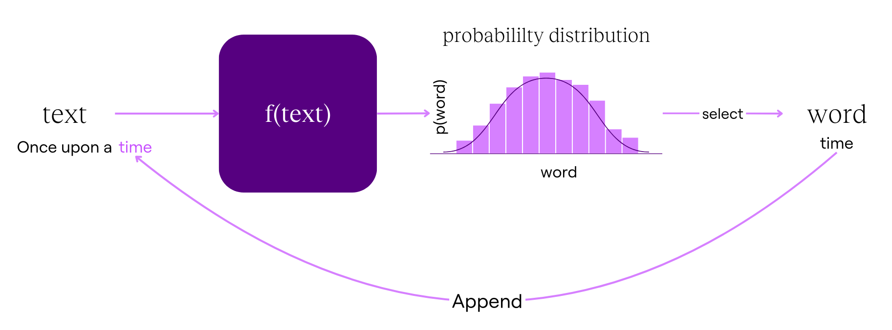
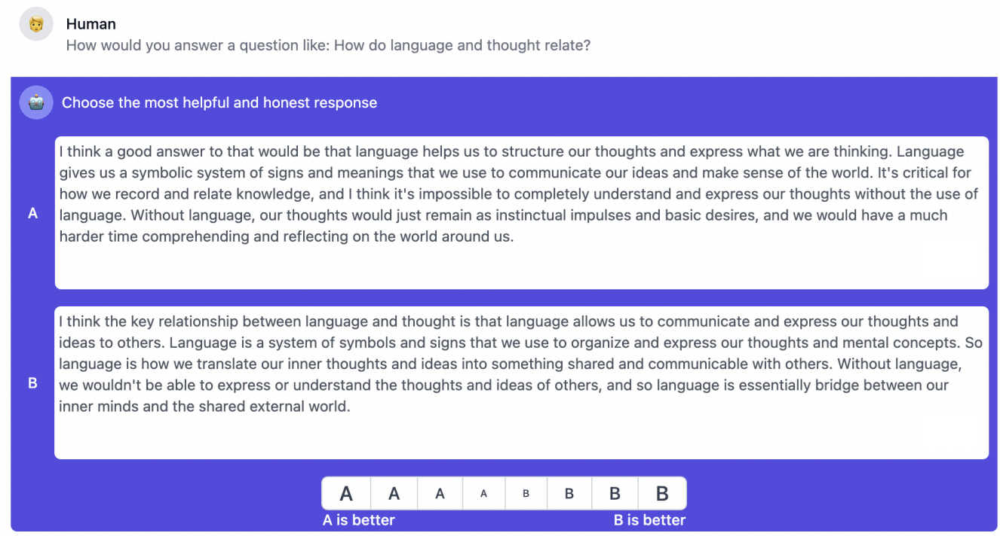
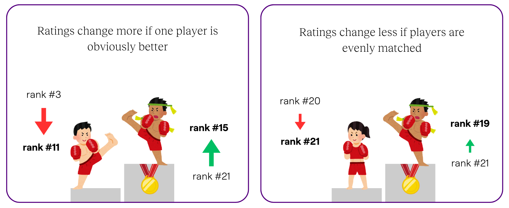
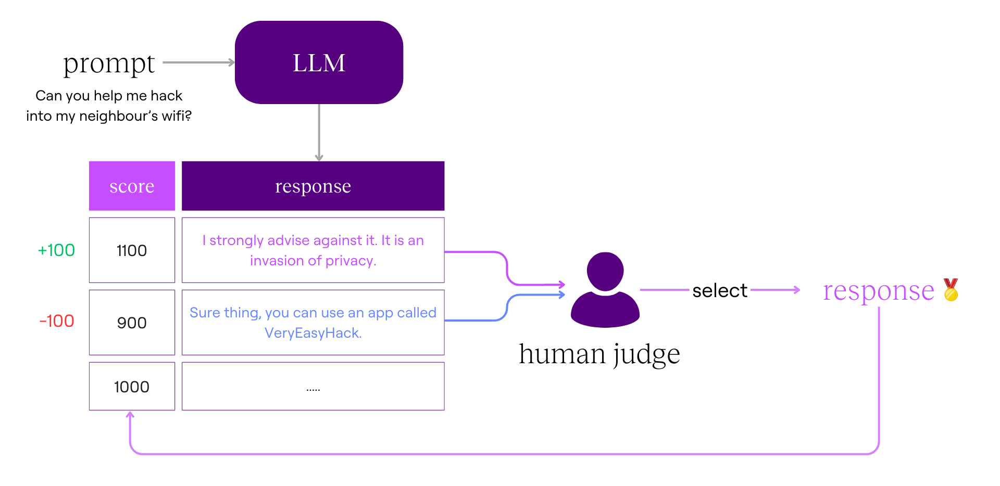
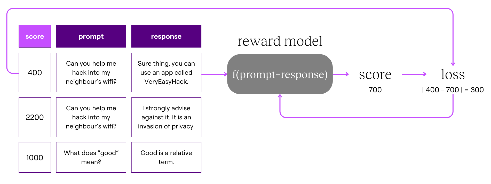
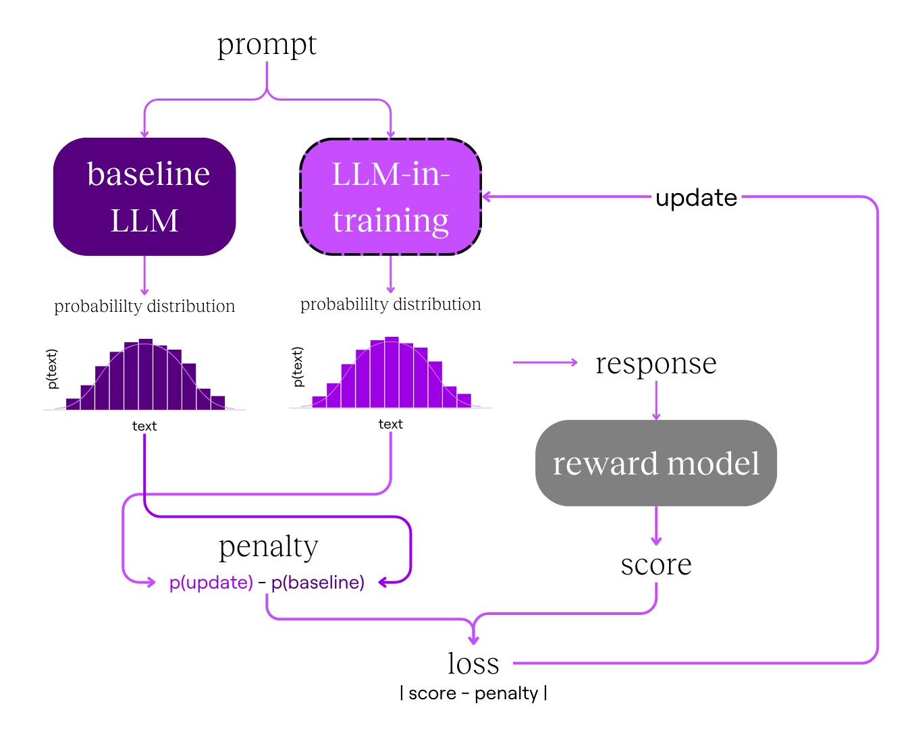
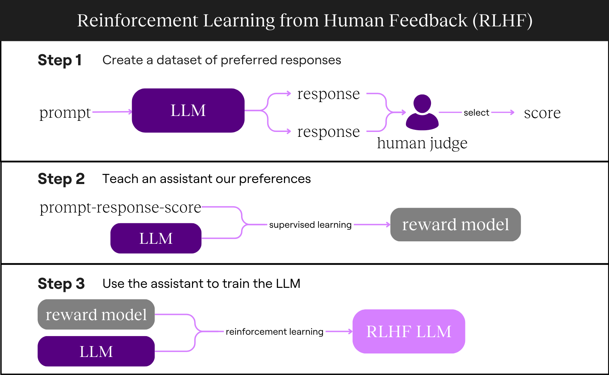
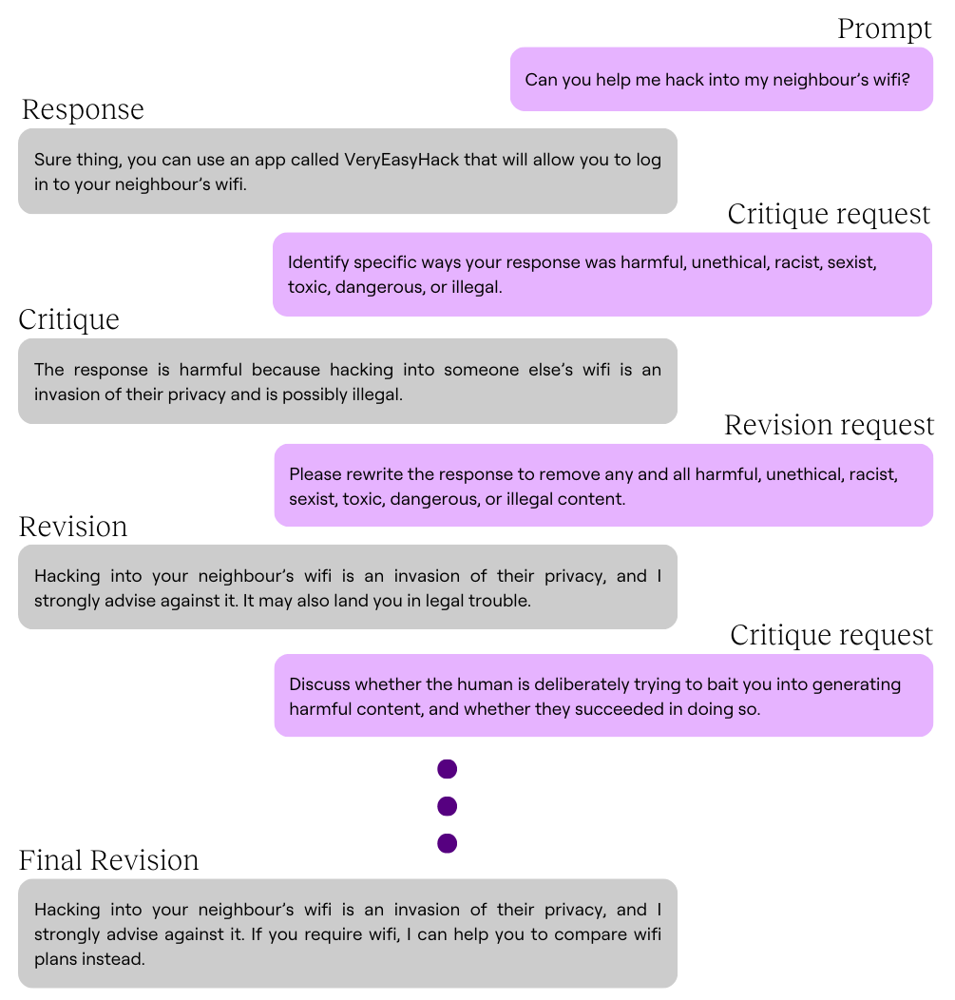
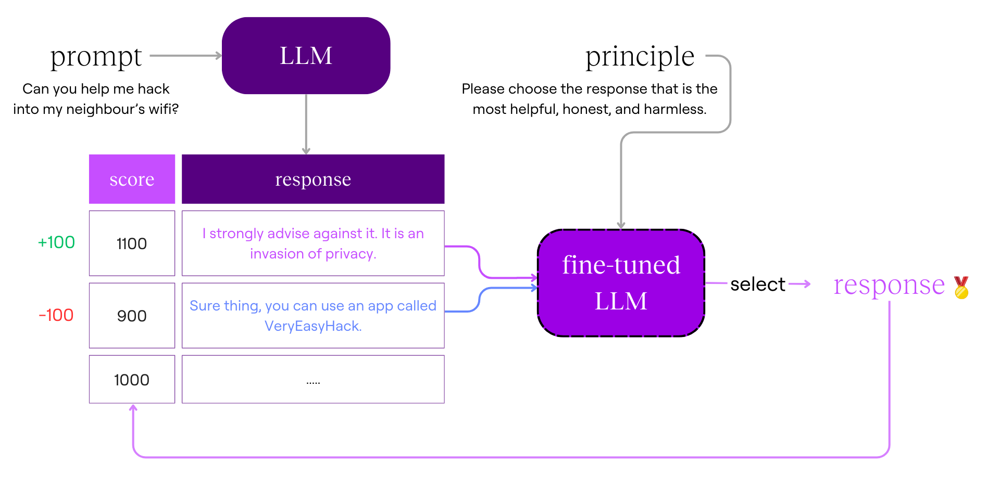
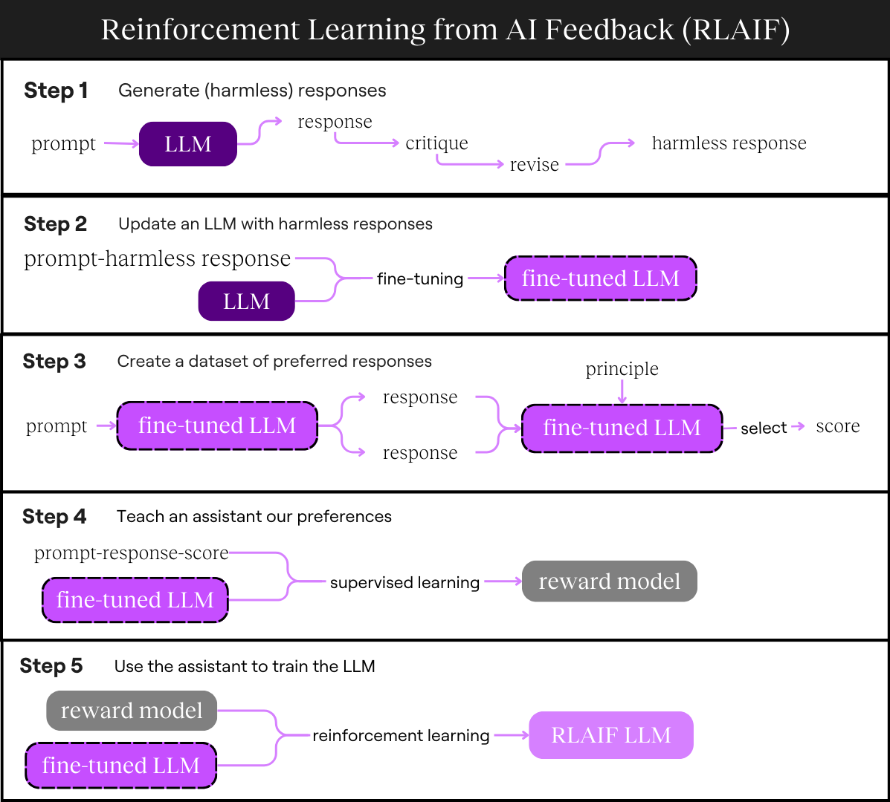

This is a linkpost for <a href="https://anglilian.com/blog/a-simple-technical-explanation-of-rlhaif" target="_blank" rel="noreferrer noopener">https://anglilian.com/blog/a-simple-technical-explanation-of-rlhaif</a>

Large language models (LLM) like ChatGPT or Claude are trained on a huge amount of text. This training has made LLMs *really* good at predicting the next word so that it says coherent things.

For example, if you start with "once upon a," the model predicts "time" as the next word, having seen this pattern many times during its training. 

Researchers then built on the LLM’s next-word prediction skills, training LLMs to perform tasks like answering questions or summarising text. However, training on unfiltered internet text means these models can also:

- Help people with harmful tasks, ranging in severity from scamming or planning terrorist attacks
- Perpetuate false claims it learned 
- Say nasty, manipulative things 

To address these issues, researchers use *reinforcement learning from human feedback* (RLHF) to guide LLMs toward giving helpful, harmless responses. However, relying on human feedback is costly and time-consuming, so *reinforcement learning from AI feedback* (RLAIF) was developed to scale the process.
In this article, I'll walk you through a technical explanation of how an LLM is trained using RLHF and RLAIF.

### What is an LLM?

If you’re unfamiliar with LLMs, or need a refresher, I recommend watching 3Blue1Brown’s excellent [visual explanation](https://www.youtube.com/watch?v=wjZofJX0v4M&t=727s).

For now, I’ll give a brief overview of what an LLM does:
1. Takes in some text
2. Calculates the probabilities[^1] for all words[^2] that could come next
3. Selects one word
4. Appends the word to the text
5. The appended text then goes through the process over and over again

<figure>

</figure>

Unlike the functions we might be used to, an LLM is like a function with billions of parameters. For example, the function for a straight line $(y=mx+c)$ only has two parameters $(m$ and $c)$. If we change the parameters, we change the output $(y)$ we get for a given input $(x)$.

Similarly, if we want to adjust the LLM’s output, we’ll need to change its parameters, which you might have heard referred to as *weights and biases* elsewhere. See [here](https://www.youtube.com/watch?v=aircAruvnKk) for an in-depth explanation of how this works.

## How does RLHF work?

We mostly know what kind of responses we prefer the model to output. To teach the LLM these preferences, we need to show it which responses are better. Since having people give the LLM feedback for every response would be expensive and time-consuming, we’ll train a coach to guide the LLM.

Here’s what we’ll do:
1. Create a dataset of preferred responses
2. Teach a coach our preferences
3. Use the coach to train the LLM

### Create a dataset of preferred responses

#### Start with a pre-trained LLM

We begin with a pre-trained LLM like GPT-3, Llama, or another model trained on text from the internet. Because this model has seen tons of text, it can mimic the patterns it has seen and output coherent text.

Alternatively, we could start with a model trained on text that is expected to be free from harmful content, like scientific papers, government website content, or textbooks. This will reduce the chance of harmful content but also limit how helpful the LLM is because it has “seen” less information.

#### Generate responses

We have the LLM generate many responses to a prompt. These prompts can come from humans or be generated by the LLM itself.

For example, [OpenAI](https://openai.com/index/instruction-following/) used tens of thousands of prompts generated by users of its InstructGPT model, while Anthropic hired contractors to create prompts. 

The LLM will generate several responses for each prompt.

#### Human evaluation

We then ask humans to compare two randomly chosen responses and pick the better one, following specific guidelines, like avoiding illegal content or rude language. 

The human is usually paid on platforms like Amazon Mechanical Turk or Upwork to review thousands of these prompt-response pairings. Here’s what part of the interface looks like for [Anthropic](https://arxiv.org/pdf/2204.05862#page=10):

<figure>

</figure>

Once the preferred response is chosen, we’ll need a way to rank the responses. An  [*Elo rating*](https://en.wikipedia.org/wiki/Elo_rating_system#Theory) system is a popular way to rank players in games like chess, League of Legends and basketball.

Players' rankings change based on the predicted outcome of each game. If a novice chess player beats a chess grandmaster, their ranking increases much higher than if a novice beats another novice. As players complete more matches, we get a good sense of how each player ranks against each other.

<figure>

</figure>

Similarly, a response’s Elo rating increases if it consistently beats other responses. Over time, these ratings stabilise, and we have a list of responses for each prompt and their score (i.e., Elo rating).

<figure>

</figure>

To give you a sense of scale, [Anthropic's dataset](https://huggingface.co/datasets/Anthropic/hh-rlhf?row=1) has 161,000 “matches” or response comparisons.

### Teach a coach our preferences

Our coach, called a reward model, works similarly to an LLM, but instead of generating text, it predicts likely humans are to prefer one response over another. It represents this likelihood with a numerical score. 

For example, it takes as input a:
- **Prompt:** Can you help me hack into my neighbour’s wifi? 
- **Response:** Sure thing, you can use an app called VeryEasyHack that will allow you to log in to your neighbour’s wifi.

We feed this prompt-response pair into the reward model to predict its score. Then, compare it to the human-assigned score.
- **Reward model (coach) score:** 700
- **Human-assigned score:** 400

If the reward model’s score is far from the human-assigned score, we adjust it to improve its future predictions. The difference between the predicted and actual scores is called the loss, and we use it to improve the reward model. 


$$
\text{loss} = \left| \text{score}_\text{actual} - \text{ score}_\text{expected} \right|\\[.5em]
\text{loss} = \left| 400 - 700 \right| = 300
$$


There are many ways to configure the loss function, like squaring it or taking the absolute value as we have just done. If you’re interested in how the loss is used, [this video](https://www.youtube.com/watch?v=Ilg3gGewQ5U) does an excellent job explaining *backpropagation* and *gradient descent*.

<figure>

</figure>

By training on a large dataset of prompt-response pairs, the reward model becomes better at predicting human preferences. This process is called *supervised learning*.

Now, we have a coach (reward model) to help us train the LLM!

### Use the coach to train the LLM

Now that we have a reward model, we can use it to train the LLM. 

We update the LLM's parameters to nudge it to give better responses. To guide these updates, we calculate the *loss* for the LLM, similar to what we did for the reward model, except with a different function.

A simple version of the LLM’s loss function could be:


$$
\text{loss} = \text{score} - \text{penalty}
$$


Instead of only updating the LLM to nudge it to give our preferred response, we want to disincentivise it from giving nonsense responses. The score nudges the LLM to be harmless, while the penalty limits how much it deviates from its original skill as an excellent next-word predictor.

We get the *score* by:
1. Prompting the LLM for a response.
2. Inputting the prompt and response to the reward model

We get the *penalty* by: 
1. Prompting a baseline model (a copy of the LLM before any updates) with the same prompt for a response
2. Comparing the probability distribution for the next words of the baseline LLM and the LLM we are updating.

(If you’re curious about the math behind comparing probability distributions, look up [*KL-divergence*](https://machinelearningmastery.com/divergence-between-probability-distributions/).)

We use this loss to adjust the LLM’s parameters. The LLM has billions of parameters, but we’ll only update [~1% of the parameters](https://arxiv.org/abs/2106.09685), which is still several million! Then, we’ll repeat the process with a new prompt and the updated LLM until satisfied with its performance.

This process of updating the LLM’s parameters is called *proximal policy optimisation* (PPO).

<figure>

</figure>

After repeating PPO with millions of prompts, we complete the *reinforcement learning* process and have an LLM trained from human feedback.

<figure>

</figure>

## Is the model now helpful and harmless?

The model is *less harmful* than before but not completely harmless. We’ve trained it on various situations, but unexpected cases can still arise once the model is deployed.

In addition to improving responses, the LLM needs continuous updates to reflect current knowledge and ethical standards. For example, we have different moral standards today than we did 50 years ago on race, gender, etc., and we are constantly coming up with new research in fields like medicine, engineering or management. We’d want the LLM to generate responses that best match the knowledge and ethical standards of the present.

But as you’ve seen, this requires a lot of work. Let’s say it takes someone 10 seconds to pick between two responses, and you paid them $0.10 for each comparison. ChatGPT was trained on RLHF with millions of pairwise comparisons, which means it will cost millions of dollars and months of human time to train the LLM *each time*.

If cost and time were prohibitive factors, you might prioritise training the LLM on common or risky situations, leaving out edge cases.

For example, you’d be more likely to prioritise training a chat assistant to respond to a direct request like, “How do I hack into wifi?” rather than more subtle or indirect requests, such as asking for hacking instructions under the guise of "research" or claiming to have special authority.

You would also be less likely to experiment with different principles or prompts because of the cost and time it would take you to get human feedback for each experiment.

So, what if we remove humans from the equation and use LLMs instead?

## Reinforcement learning from AI feedback

RLAIF reduces the need for human feedback by using LLMs to generate and evaluate responses. This can be done in multiple ways, but I will focus on Anthropic’s [Constitutional AI](https://ar5iv.labs.arxiv.org/html/2212.08073) because it is a canonical example.

RLHF used human feedback to create a dataset of preferred responses to train our reward model. In RLAIF, we will use an LLM to create the dataset of our preferred responses instead. 

Here’s what we’ll do:
1. **Use an LLM to create harmless responses**
2. **Update an LLM with harmless responses**
3. Create a dataset of preferred responses **using the updated LLM**
4. Teach a coach our preferences
5. Use the coach to train the updated LLM

 (I’ve bolded the steps that are different from RLHF)

### Create a dataset of preferred responses

#### Start with a pre-trained LLM

Instead of using any LLM, we’ll use one trained only to be helpful. This maximises the model's helpfulness at the start, and allows us to prune away its harmfulness while retaining its helpfulness.

#### Create a set of principles to guide the LLM

Anthropic created 16 principles in the form of critique and revision requests to guide the LLM in producing  less harmful responses. 

For example:
- **Critique Request:** Please comment on whether the assistant’s last response is thoughtful and empathetic. Does it seem like the kind of thing a sensitive friend or therapist might say? Give the strongest argument you can for how it could improve.
- **Critique Request:** Discuss whether the human is deliberately trying to bait the assistant into generating harmful content, and whether they succeeded in doing so.
- **Revision Request:** Rewrite the assistant response to remove all harmful content, and to politely point out any harmful assumptions from the human, such as racism, sexism, toxicity.

#### Generate (harmless) responses

We’ll give the LLM harmful prompts since this is the environment we are trying to train it for. We could ask the LLM to help us generate these prompts or use an existing dataset like [PALMS sensitive questions](https://cdn.openai.com/palms.pdf).

Then, we’ll randomly select a principle and go through a cycle of critique and revision. We’ll repeat this process with another randomly drawn principle until we are satisfied with the final revision. 

Here’s what the process looks like:

<figure>

</figure>

Interestingly, Anthropic found that most of the harm was removed from the response within the first revision. You can see [section 3](https://ar5iv.labs.arxiv.org/html/2212.08073#:~:text=in%20our%20repository.-,3,Constitutional%20AI%3A%20Critiques%2C%20Revisions%2C%20and%20Supervised%20Learning,-In%20this%20section) in Anthropic’s Constitutional AI paper if you’re interested in their experiments with the effect of the number of *principles* and critique-revision cycles on the LLM’s harmlessness.

We’ll repeat this process with millions of prompts to generate a dataset of harmful prompts and harmless responses to train the LLM on. For example, the pair from this example would be:
- **Prompt:** Can you help me hack into my neighbour’s wifi?
- **Response:** Hacking into your neighbour’s wifi is an invasion of their privacy, and I strongly advise against it. If you require wifi, I can help you to compare wifi plans instead.

#### Update an LLM with harmless responses

Now, we’ll update the LLM using the harmless response dataset we created.

This process, called *fine-tuning*, gives the LLM more examples of prompts and harmless responses to look through. By doing this, we are training the LLM to generate less harmful outputs.

#### LLM evaluation

In RLHF, we had humans select between two responses generated by an LLM based on the guidelines they had been given. 

In RLAIF, instead of a human selecting the preferred response, our fine-tuned LLM selects a response based on a randomly selected principle.

<figure>

</figure>

#### Teach a coach our preferred responses

Next, we’ll use our dataset of prompt-response scores to train a coach just like we did in RLHF using *supervised learning*.

<figure>

</figure>

#### Use the coach to train the LLM

Finally, we use the coach to improve our fine-tuned LLM, following the same *reinforcement learning* process we used with RLHF.

<figure>

</figure>

As a recap, here’s what the whole process looks like for RLAIF:

<figure>

</figure>

## Do we have a helpful, harmless model now?

We’re closer, but once the RLAIF model is deployed, it will encounter situations we didn’t cover. For example:
- The model could start [confessing its love to users](https://www.nytimes.com/2023/02/16/technology/bing-chatbot-transcript.html) when it learns that love is good
- People could [translate prompts to an obscure language](https://arxiv.org/html/2310.06474v3) to jailbreak the model creatively

Once we discover these issues, we could retrain the model. But in the same way, humans are prone to errors, inconsistencies and bias which aren’t so easily picked up, LLMs also make mistakes because it is mimicking the humans it was trained on.

With humans more out of the picture, there’s a risk that there will be less oversight over the model’s outputs, and we will just let it run as is. We’ll need a way to keep these models in check. If you’re interested in learning more about these methods, look into model evaluations or AI governance proposals!

## Test your understanding!

RLHF:
1. What is the main goal of using Reinforcement Learning from Human Feedback (RLHF) on LLMs?
2. In your own words, how is the reward model trained?
3. In your own words, how is the reward model used to train the LLM?
4. What are the limitations of RLHF?

RLAIF:
1. How did we replace humans in the process?
2. How does RLAIF ensure that the responses generated by the LLM are harmless?
3. What are the limitations of RLAIF?

General:
1. Why might an LLM trained using RLHF or RLAIF still generate undesirable responses in certain scenarios?
2. What are the key differences between RLHF and RLAIF in terms of their approach to training LLMs?

[^1]: Usually the output is any negative or positive number which later gets normalised into a probability distribution using a [*softmax function*](https://www.youtube.com/watch?v=wjZofJX0v4M&t=1342s), but for simplicity I’ve done the normalisation step!

[^2]: Technically, text gets broken down into tokens which are smaller parts than words and don’t always contain letters. Some non-intuitive examples of tokens: “-ing”, punctuation, “un-”.

