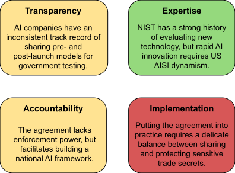

This is a linkpost for <a href="https://www.techpolicy.press/the-us-governments-ai-safety-gambit-a-step-forward-or-just-another-voluntary-commitment/" target="_blank" rel="noreferrer noopener">https://www.techpolicy.press/the-us-governments-ai-safety-gambit-a-step-forward-or-just-another-voluntary-commitment/</a>

<figure>

<figcaption style="font-size:small">Vice President Kamala Harris, pictured speaking with AI company executives in May 2023, announced the White House’s policy on uses of AI across government in a speech on March 28, 2024. (Lawrence Jackson / The White House)</figcaption>
</figure>

Last month, the year-old <a href="https://www.nist.gov/aisi" target="_blank" rel="noreferrer noopener">US AI Safety Institute</a> (US AISI) took a significant step by signing <a href="https://www.nist.gov/news-events/news/2024/08/us-ai-safety-institute-signs-agreements-regarding-ai-safety-research" target="_blank" rel="noreferrer noopener">an agreement</a> with two AI giants, OpenAI and Anthropic. The companies committed to sharing pre- and post-deployment models for government testing, a move that could mark a leap toward safeguarding society from AI risks. However, the effectiveness of this <a href="https://www.whitehouse.gov/briefing-room/statements-releases/2023/07/21/fact-sheet-biden-harris-administration-secures-voluntary-commitments-from-leading-artificial-intelligence-companies-to-manage-the-risks-posed-by-ai/" target="_blank" rel="noreferrer noopener">voluntary commitment</a> remains to be seen, as a <a href="https://www.gov.uk/government/publications/ai-safety-summit-2023-chairs-statement-safety-testing-2-november/safety-testing-chairs-statement-of-session-outcomes-2-november-2023" target="_blank" rel="noreferrer noopener">comparable 2023 agreement</a> with the <a href="https://www.aisi.gov.uk/" target="_blank" rel="noreferrer noopener">UK AI Safety Institute</a> (UK AISI) has had varied results.

## The Agreement: A Closer Look 

To assess whether this agreement marks a substantive step toward safe AI development, we need to examine it from four perspectives:

<ol>
<li><strong>Transparency</strong>: How much information will the companies actually share?</li>
<li><strong>Expertise</strong>: Does the government agency have the necessary capabilities to evaluate these complex systems?</li>
<li><strong>Accountability</strong>: What happens if safety issues are identified?</li>
<li><strong>Implementation</strong>: Can this agreement be effectively operationalized in practice?</li>
</ol>

These criteria are inspired by lessons learned from historical US safety testing in industries such as <a href="https://www.nhtsa.gov/ratings" target="_blank" rel="noreferrer noopener">transportation</a> and <a href="https://www.faa.gov/about/initiatives/iasa" target="_blank" rel="noreferrer noopener">aviation</a>, where enforceable standards have built trust and improved safety outcomes. They also draw from my professional experience developing governance strategies for a technology company interfacing with external regulators.

## Overview: The US AISI Agreement with OpenAI and Anthropic

<figure>

<figcaption  style="font-size:small">Issues pertaining to the US AISI agreement with OpenAI and Anthropic.</figcaption></figure>

#### Transparency: A Promising Start

OpenAI and Anthropic's agreement to submit their AI models for government testing represents a significant step towards transparency in AI development. However, the practical implications of this commitment remain to be seen.

This isn't the first such agreement for these AI companies – in 2023, they joined other leading labs in a similar pledge to the UK AISI. By June 2024, <a href="https://www.anthropic.com/news/claude-3-5-sonnet" target="_blank" rel="noreferrer noopener">Anthropic</a> and <a href="https://www.politico.eu/article/rishi-sunak-ai-testing-tech-ai-safety-institute/" target="_blank" rel="noreferrer noopener">Google DeepMind</a> had followed through. However, while OpenAI has shared post-launch models, it is uncertain whether they've allowed the UK AISI pre-deployment access. Nevertheless, OpenAI CEO Sam Altman specified his support for the US AISI to conduct “pre-release testing” in an August 2024 post on <a href="https://x.com/sama/status/1829205847731515676" target="_blank" rel="noreferrer noopener">X</a>.

The UK AISI <a href="https://www.commerce.gov/news/press-releases/2024/04/us-and-uk-announce-partnership-science-ai-safety" target="_blank" rel="noreferrer noopener">shared testing results</a> with the US AISI this summer, exemplifying growing international cooperation in AI safety efforts. Repeated commitments on both sides of the Atlantic underscore a growing consensus on the importance of external oversight in AI development.

Still, the devil is in the details when determining whether US AISI can interpret the models once shared. Anthropic's co-founder Jack Clark acknowledged to <a href="https://www.politico.eu/article/rishi-sunak-ai-testing-tech-ai-safety-institute/" target="_blank" rel="noreferrer noopener">Politico</a> in April that "pre-deployment testing is a nice idea, but very difficult to implement."

#### Expertise: Building Capacity

Led by <a href="https://www.nist.gov/people/elizabeth-kelly" target="_blank" rel="noreferrer noopener">Elizabeth Kelly</a>, one of <a href="https://time.com/7012783/elizabeth-kelly/" target="_blank" rel="noreferrer noopener"><em>Time</em>’s 100 Most Influential People in AI</a>, the US AISI brings together a multidisciplinary team of technologists, economists, and policy experts. Operating within the (<a href="https://www.washingtonpost.com/technology/2024/03/06/nist-ai-safety-lab-decaying/" target="_blank" rel="noreferrer noopener">reportedly underfunded</a>) National Institute for Standards and Training (NIST), the US AISI seems substantively well-positioned to develop industry standards for AI safety.

NIST’s work ranges from <a href="https://www.nist.gov/programs-projects/ai-measurement-and-evaluation/nist-ai-measurement-and-evaluation-projects" target="_blank" rel="noreferrer noopener">biometric recognition to intelligent systems</a>. While the historical expertise provides a solid foundation, the rapid advancements in large language models (LLMs) present new challenges. NIST’s new <a href="https://www.nist.gov/news-events/news/2024/05/nist-launches-aria-new-program-advance-sociotechnical-testing-and" target="_blank" rel="noreferrer noopener">Assessing Risks and Impacts of AI (ARIA) program</a> and <a href="https://www.nist.gov/itl/ai-risk-management-framework" target="_blank" rel="noreferrer noopener">AI Risk Management Framework</a> are particularly relevant to evaluating LLMs, but the dynamic field demands continuous adaptation.

US AISI also faces the challenge of attracting top talent in a competitive market. While leading AI researchers in the private sector can have <a href="https://www.wsj.com/articles/artificial-intelligence-jobs-pay-netflix-walmart-230fc3cb" target="_blank" rel="noreferrer noopener">salaries nearing $1 million</a>, government agencies typically offer more modest compensation packages, potentially <a href="https://www.wired.com/story/regulators-need-ai-expertise-cant-afford-it/" target="_blank" rel="noreferrer noopener">impacting their ability to recruit</a> cutting-edge expertise.

The US AISI's ability to develop robust industry standards for AI safety will depend not only on leveraging NIST's historical expertise, but also on successfully bridging the <a href="https://www.washingtonpost.com/technology/2024/03/10/big-tech-companies-ai-research/" target="_blank" rel="noreferrer noopener">talent gap</a> between public and private sectors.

#### Accountability: The Missing Link

While the US AISI agreement with OpenAI and Anthropic <a href="https://www.nist.gov/news-events/news/2024/08/us-ai-safety-institute-signs-agreements-regarding-ai-safety-research" target="_blank" rel="noreferrer noopener">promises</a> "<a href="https://www.nist.gov/news-events/news/2024/08/us-ai-safety-institute-signs-agreements-regarding-ai-safety-research" target="_blank" rel="noreferrer noopener">collaboration on AI safety research, testing and evaluation,"</a> critical details remain unclear. The full agreement is not publicly available and the press release didn't specify enforcement mechanisms or consequences for disregarding evaluation results – nor did it define what constitutes actionable findings.

Despite the ambiguity surrounding how OpenAI and Anthropic will incorporate US AISI's test results, this agreement fulfills a commitment made by the US at the 2023 UK AI Safety Summit. There, 28 countries and the European Union <a href="https://www.gov.uk/government/publications/ai-safety-summit-2023-chairs-statement-safety-testing-2-november/safety-testing-chairs-statement-of-session-outcomes-2-november-2023" target="_blank" rel="noreferrer noopener">affirmed</a> their <a href="https://www.gov.uk/government/publications/ai-safety-summit-2023-chairs-statement-safety-testing-2-november/safety-testing-chairs-statement-of-session-outcomes-2-november-2023" target="_blank" rel="noreferrer noopener">"responsibility for the overall framework for AI in their countries"</a> and agreed that testing should address AI models' potentially harmful capabilities.

While it remains to be seen whether the US AISI will add enforcement power to its agreement with OpenAI and Anthropic, the national - and complementary international - agreement at least creates a pathway for the US AISI to scrutinize AI development in the public interest.

#### Implementation: The Real Challenge

Operationalizing this agreement faces several hurdles:

<strong>Developing an interface for sharing sensitive model information.</strong> There are trade-offs between protecting the AI companies’ proprietary technology – in the interest of both business competition and national security – and incentivizing multiple AI companies to share model access with a <a href="https://www.csis.org/analysis/ai-seoul-summit" target="_blank" rel="noreferrer noopener">growing list</a> of national AI Safety Institutes. Scaling a secure, interoperable application programming interface (API) that enables different AI company systems to communicate with multiple governments’ AI Safety Institute programs may be a cost effective mechanism for both sets of stakeholders to adapt as the landscape of international oversight and regulation evolves.

<strong>Adapting internal operations to integrate testing.</strong> For AI companies, this means integrating consistent model submission intervals into their existing product development cycles to minimize business operation and product launch disruptions. Understanding the US AISI's estimated testing timelines will be crucial for standardizing this new step in their processes. Simultaneously, the nascent US AISI faces the challenge of rapidly building its capabilities. Staffing the less-than-year-old institute with AI and testing experts is critical for <a href="https://www.techpolicy.press/mandated-thirdparty-ai-audits-are-coming-addressing-ais-sociotechnical-challenges-will-be-key/" target="_blank" rel="noreferrer noopener">developing robust third-party evaluations</a> of frontier AI models.

<strong>Establishing a feedback process between AI labs and the US AISI.</strong> If the only requirement is for AI labs to submit their models for testing, there may be minimal disruptions to AI labs' development cycles, but also less comprehensive evaluations. Conversely, if AI labs are expected to engage in ongoing dialogue throughout the testing and evaluation process, assessments would be more thorough, but at a higher time and resource cost from both the labs and the US AISI. The selected approach will impact the depth of evaluations, the speed of the process, and the potential for real-time adjustments to AI systems. Clearly defining expectations at the beginning will be fundamental to building trust, ensuring transparency, and maintaining the long-term legitimacy of the agreement.

<strong>Balancing transparency with the protection of trade secrets.</strong> While OpenAI and Anthropic are not required to publicly disclose AI safety issues, their approach has been proactive: Anthropic's <a href="https://www-cdn.anthropic.com/1adf000c8f675958c2ee23805d91aaade1cd4613/responsible-scaling-policy.pdf" target="_blank" rel="noreferrer noopener">Responsible Scaling Policy</a> commits to publishing safety guardrail updates, and OpenAI issues <a href="https://openai.com/index/gpt-4o-system-card/" target="_blank" rel="noreferrer noopener">System Cards</a> detailing safety testing for each model launch. The US AISI, following NIST's long-standing tradition of public reporting, is likely to share its evaluation tools and results. However, all have to be careful to avoid exposing sensitive information that could compromise market competition and/or national security.

## The Road Ahead: From Voluntary to Mandatory?

While the agreement may not be immediately fully operationalizable – given the <a href="https://www.anthropic.com/news/third-party-testing" target="_blank" rel="noreferrer noopener">early stages</a> of third-party evaluations – the government's proactive investment in this capability demonstrates foresight. The agreement positions the US AISI to effectively implement evaluations once industry standards solidify. This proactive approach enables the agency to be ready for a future where AI safety testing could <a href="https://www.techpolicy.press/mandated-thirdparty-ai-audits-are-coming-addressing-ais-sociotechnical-challenges-will-be-key/" target="_blank" rel="noreferrer noopener">become a routine</a> part of development cycles.

As AI capabilities continue to advance at a breakneck pace, the pressure for mandatory compliance and regulation has grown. In Silicon Valley’s home state of California, where both OpenAI and Anthropic are headquartered, the Governor recently signed into law several AI bills about <a href="https://www.washingtonpost.com/technology/2024/09/18/california-ai-bills-actors-election-deepfake/" target="_blank" rel="noreferrer noopener">deep fakes</a> and <a href="https://www.gov.ca.gov/2024/09/19/governor-newsom-signs-bills-to-crack-down-on-sexually-explicit-deepfakes-require-ai-watermarking/" target="_blank" rel="noreferrer noopener">watermarking</a>. While US federal regulation remains <a href="https://www.washingtonpost.com/technology/2024/05/15/congress-ai-road-map-regulation-schumer/" target="_blank" rel="noreferrer noopener">to be seen</a>, the recently elected UK Labour government has <a href="https://time.com/6997876/uk-labour-ai-kyle-starmer/" target="_blank" rel="noreferrer noopener">signaled</a> its intent to introduce <a href="https://time.com/6997876/uk-labour-ai-kyle-starmer/" target="_blank" rel="noreferrer noopener">"binding regulation on the handful of companies developing the most powerful AI models."</a>

## Conclusion: A Foundation to Build On

The US AISI's agreement with OpenAI and Anthropic represents a crucial step in the US government's efforts to ensure AI safety. While it falls short in terms of accountability and clear enforcement mechanisms, it establishes a framework for collaboration that can be built upon in the future.

The true test will be in the implementation. Can the US AISI effectively evaluate these AI models? Will the companies act on any safety concerns raised? And perhaps most importantly, will this voluntary agreement pave the way for more robust, legally binding regulations in the future?

The success or failure of initiatives like this will play a crucial role in shaping the future of AI governance – and potentially, the future of humanity itself.
