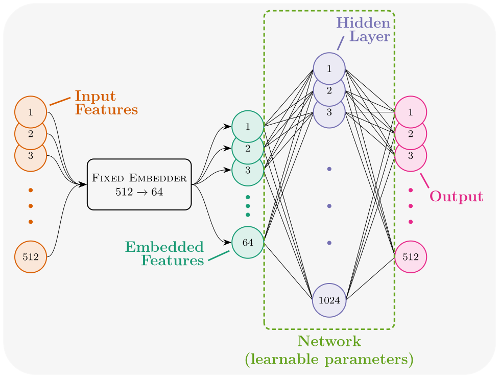

Darryl and I discuss his background, how he became interested in machine learning, and a project we are currently working on investigating the penalization of polysemanticity during the training of neural networks.



<figure>
    
    <figcaption style="font-size:small; text-align:center">Image by <a href="https://jacob-haimes.github.io" target="_blank" rel="noreferrer noopener">Jacob Haimes</a> / © Kairos.fm / Polysemanticity Research Diagram / <a href="https://creativecommons.org/licenses/by/4.0/" target="_blank" rel="noreferrer noopener">CC-BY 4.0</a></figcaption>
</figure>

### Chapters

01:46 ❙ Interview begins 
02:14 ❙ Supernovae classification 
08:58 ❙ Penalizing polysemanticity 
20:58 ❙ Our "toy model" 
30:06 ❙ Task description 
32:47 ❙ Addressing hurdles 
39:20 ❙ Lessons learned

### Links

Links to all articles/papers which are mentioned throughout the episode can be found below, in order of their appearance.
- <a href="https://www.zooniverse.org" target="_blank" rel="noreferrer noopener">Zooniverse</a>
- <a href="https://bluedot.org" target="_blank" rel="noreferrer noopener">BlueDot Impact</a>
  - <a href="https://course.aisafetyfundamentals.com/alignment" target="_blank" rel="noreferrer noopener">AI Safety Fundamentals</a>
- <a href="https://www.aisafetysupport.org" target="_blank" rel="noreferrer noopener">AI Safety Support</a>
- <a href="https://distill.pub/2020/circuits/zoom-in/" target="_blank" rel="noreferrer noopener">Zoom In: An Introduction to Circuits</a>
- <a href="https://paperswithcode.com/dataset/mnist" target="_blank" rel="noreferrer noopener">MNIST</a> dataset on PapersWithCode
  - <a href="https://en.wikipedia.org/wiki/MNIST_database" target="_blank" rel="noreferrer noopener">MNIST</a> on Wikipedia
- <a href="https://arxiv.org/abs/2103.03386" target="_blank" rel="noreferrer noopener">Clusterability in Neural Networks</a>
- <a href="https://www.cs.toronto.edu/~kriz/cifar.html" target="_blank" rel="noreferrer noopener">CIFAR-10</a> dataset
- <a href="https://www.effectivealtruism.org/ea-global" target="_blank" rel="noreferrer noopener">Effective Altruism Global</a>
- <a href="https://openai.com/research/clip" target="_blank" rel="noreferrer noopener">CLIP</a> Blog
  - <a href="https://github.com/openai/CLIP" target="_blank" rel="noreferrer noopener">CLIP</a> on GitHub
- <a href="https://funds.effectivealtruism.org/funds/far-future" target="_blank" rel="noreferrer noopener">Long Term Future Fund</a>
- <a href="https://arxiv.org/abs/2211.09169" target="_blank" rel="noreferrer noopener">Engineering Monosemanticity in Toy Models</a>

<!-- end of the list -->
