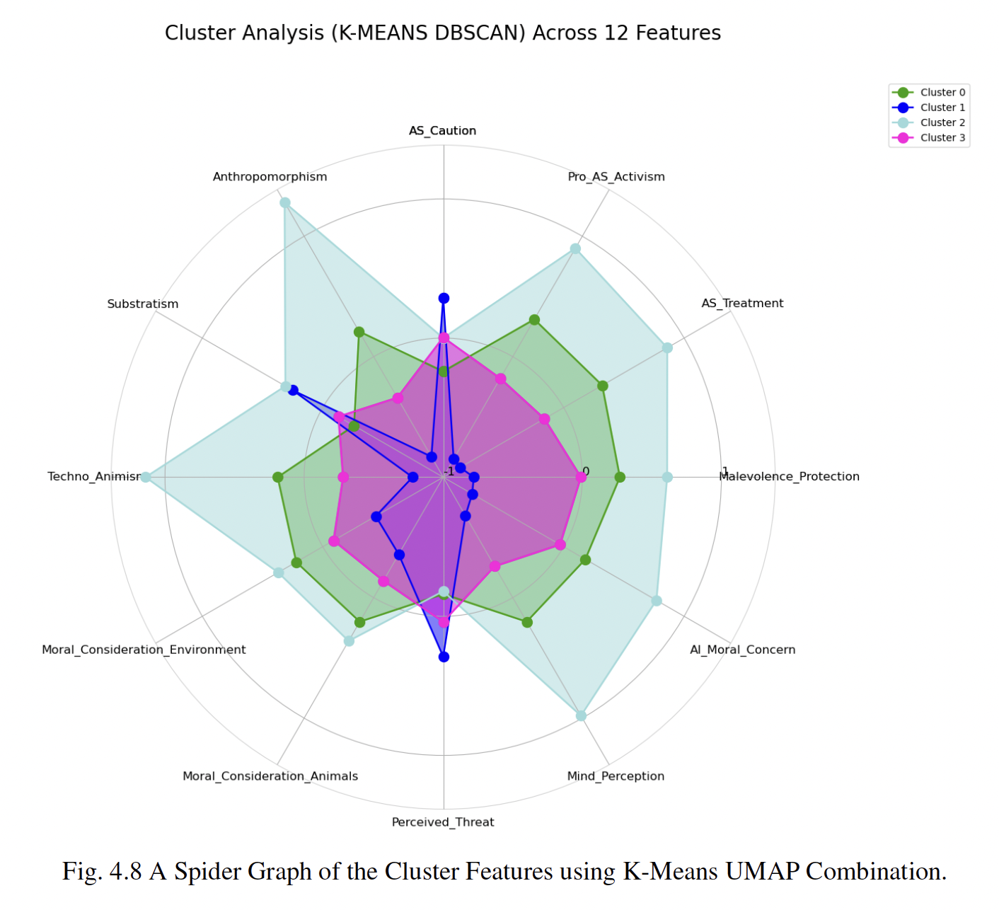
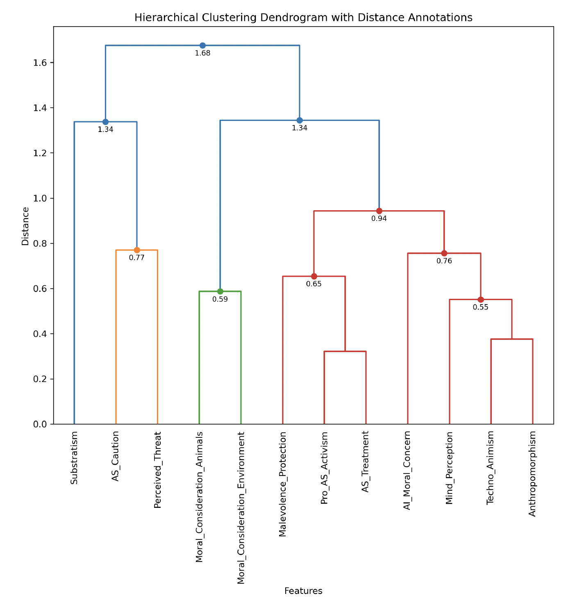

## Summary

<div style="text-align: justify">

AI sentience is a divisive issue, with public opinion showing a wide spectrum of views. This study used unsupervised clustering algorithms, including K-Means, DBSCAN, and Hierarchical Clustering, to analyze responses from large-scale surveys conducted in 2021 and 2023. The results uncovered distinct clusters of respondents based on their views toward AI sentience and rights, showing strong demographic correlations. Younger, more educated respondents, particularly those exposed to AI narratives, were more likely to advocate for AI rights, while older, less educated, and more conservative individuals expressed caution or skepticism.

The study employed a range of clustering methods, ultimately finding that K-Means combined with UMAP produced the most distinct and interpretable clusters. The analysis revealed five main demographic groups, each characterized by different attitudes toward AI sentience, moral consideration, and perceived threats from AI. These insights into public opinion highlight the complexities of AI ethics debates and the importance of considering public sentiment when designing AI governance frameworks.

</div>

<figure>
    
    <figcaption style="font-size:small">Image by <a href="https://alanwarburton.co.uk/" target="_blank" rel="noreferrer noopener">Alan Warburton</a> / © BBC / <a href="https://www.betterimagesofai.org" target="_blank" rel="noreferrer noopener">Better Images of AI</a> / Virtual Human / <a href="https://creativecommons.org/licenses/by/4.0/" target="_blank" rel="noreferrer noopener">Licenced by CC-BY 4.0</a></figcaption>
</figure>

<!-- ## Results

<div style="text-align: justify">

- **K-Means Clustering:** Identified four distinct clusters based on public opinions toward AI sentience and rights. The most supportive group was predominantly younger, more diverse, and well-educated, while the most skeptical group was older and politically conservative.
- **DBSCAN Results:** Revealed that while DBSCAN was effective in identifying outliers, it struggled to produce well-defined clusters, especially when compared to K-Means and Hierarchical Clustering.
- **Hierarchical Clustering:** Demonstrated a clear separation of groups, but the clustering was less informative and resulted in imbalanced sizes.

</div> -->

### Key Findings

<div style="text-align: justify">

- **Supportive Cluster:** Younger, more educated individuals were highly supportive of AI rights and activism, perceiving AI as potentially sentient and deserving of moral consideration.
- **Cautious Cluster:** Older, conservative respondents showed significant resistance to AI rights, viewing AI as a potential threat.
- **Neutral Cluster:** Respondents with moderate views on AI were more balanced in their attitudes, neither fully supporting nor opposing AI rights.
- **Demographic Trends:** Political orientation, age, and education level were key factors in determining public opinion on AI sentience.

</div>

<div class="grid grid-cols-1 items-start md:items-center gap-x-8 gap-y-8 sm:gap-y-16 md:grid-cols-2">
<div><figure>
    
    <figcaption style="text-align:center; font-size:small">Figure 4.8: Spider plot comparing  12 features across the four identified clusters.</figcaption>
</figure></div>
<div><figure>
    
    <figcaption style="text-align:center; font-size:small">Hierarchical clustering dendogram with distance annotations. </figcaption>
</figure></div>
</div>

## Methodology

<div style="text-align: justify">

- Applied K-Means, DBSCAN, and Hierarchical Clustering to survey data from 2,401 respondents.
- Used qualitative and quantitative feature reduction techniques (PCA, UMAP) to simplify complex survey data and improve clustering accuracy.
- Quantitative evaluation included metrics such as Silhouette Score and Davies-Bouldin Index to assess clustering quality.

</div>

## Takeaways
 
<div style="text-align: justify">

- **Demographic Influence:** Public perceptions of AI sentience and rights are strongly linked to demographic factors such as age, education, and political orientation.
- **AI Policy Implications:** Policymakers should consider these diverse public views when crafting AI governance and ethical frameworks, particularly as AI continues to advance and becomes more integrated into society.
- **Future Research Direction:** Further studies could explore how public opinion evolves as AI technologies develop and whether changes in public sentiment influence policy decisions.

<!-- This study provides a foundation for understanding how public opinion on AI sentience may shape the future of AI ethics, governance, and policy. -->

</div>

## Citation

```text
@thesis{cizem2024ai,
  author = {Zeynep Cizem, Su},
  title = {AI Sentience and Moral Rights: Understanding Public Perception},
  year = {2024},
  language = {en},
}
```