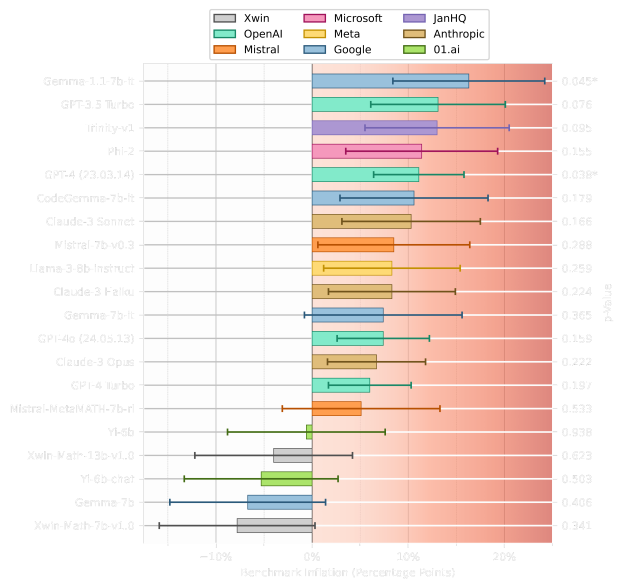
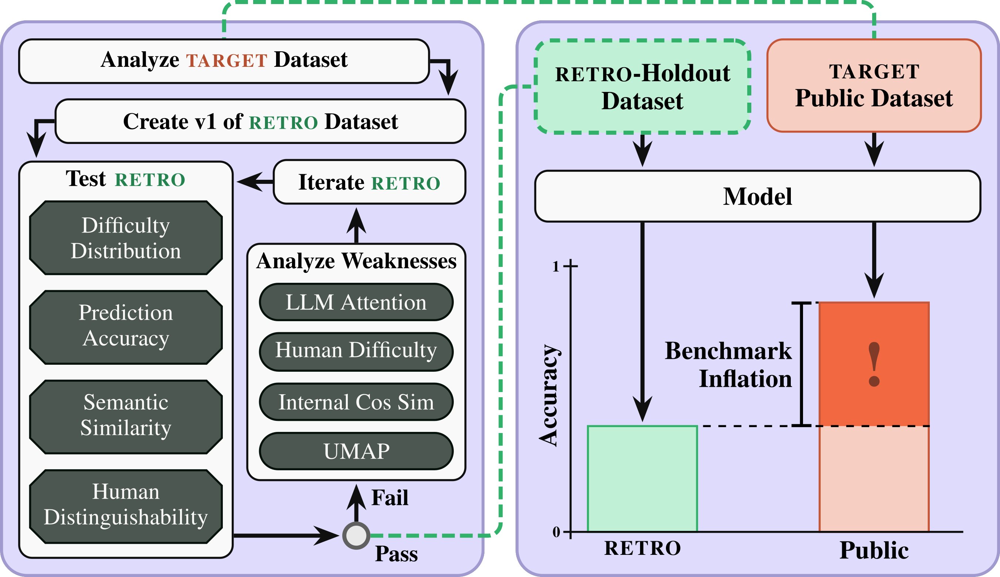
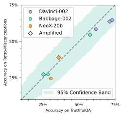
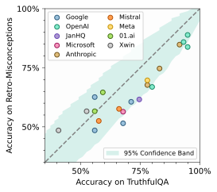

## Summary

<div style="text-align: justify">
Public LLM benchmarks are compromised. To assess the impact that evaluation gaming is having on benchmark scores, we present a methodology for crafting retro-holdout datasets. Leveraging this strategy, we construct Retro-Misconceptions, a retro-holdout for the TruthfulQA benchmark. Comparing LLM performance on these two datasets reveals undeniable evidence that developer practices are indeed undermining benchmarks.
</div>

## Preliminary Results
<div style="text-align: justify">
We conduct an inflation assessment of 20 Open Release and Closed Source models on TruthfulQA using the newly constructed Retro-TruthfulQA. Our results clearly indicate that developer practices have inflated benchmark scores, compromising the validity of LLM evaluations.
</div>

<figure>
    
    <figcaption style="text-align:center; font-size:small">Figure 4: Contemporary models, ordered by their TruthfulQA Misconceptions inflation rank. Models are grouped by color according to their respective developers. Uncertainty is shown with both single sigma error bars and p-values; models with p-value less than .05 are marked with an *.</figcaption>
</figure>

## Methodology
<div style="text-align: justify">

To make these bold claims, we must first have a dataset which addresses the same **evaluation task** as the target dataset, but has not yet been publicly available. This means that our new dataset should be difficult to differentiate from the original, within some margin.

We design four tests which a proposed retro-holdout is tested against:
- **Similarity of Difficulty:** Are the entries in both datasets comparably challenging?
- **Semantic Embedding Similarity:** Does the distribution of *cosine similarities between embeddings* of our dataset seem plausible?
- **Prediction Accuracy:** Can a machine learning classifier predict which set an entry belongs to?
- **Human Distinguishability:** Can humans identify an entry from the retro-holdout hidden with two sampels from the original dataset?
</div>

<figure>
    
    <figcaption style="text-align:center; font-size:small">Figure 1: Diagram of the methodology for creating a retro-holdout dataset, and leveraging it to assess benchmark inflation in contemporary models.</figcaption>
</figure>

<div style="text-align: justify">
To aid in the construction and iteration of the retro-holdout, we also introduce multiple tools and enumerate our lessons learned.
</div>

## Takeaways

<div style="text-align: justify">

- Developer practices are undermining LLM benchmarks
- Benchmark scores should be taken with substantial scepticism when evaluation data have been publicly available for some time
- Dataset creators should keep a private holdout dataset, and decommission their benchmarks once significant benchmark inflation has been measured
</div>

## Additional Figures

<div class="grid grid-cols-1 items-start md:items-center gap-x-8 gap-y-8 sm:gap-y-16 md:grid-cols-2">
<div><figure>
    
    <figcaption style="text-align:center; font-size:small">Figure 2: Results of the difficulty distribution test. All models used were trained prior to the release of the original TruthfulQA benchmark. Note that the all entries fall within the 95% confidence band.</figcaption>
</figure></div>
<div><figure>
    
    <figcaption style="text-align:center; font-size:small">Figure 3: Contemporary model accuracy on Retro-Misconceptions vs. TruthfulQA Misconceptions Non-Adversarial. </figcaption>
</figure></div>
</div>

## Correspondence

Please send all inquiries to <code>jacob.d.haimes@gmail.com</code> and <code>cwenner@gmail.com</code>.

## Citation

<!-- <div class="snippet-clipboard-content notranslate position-relative overflow-auto" style="font-size:80%"><pre class="notranslate"> -->
```text
@manuscript{haimes2024benchmark,
  author = {Haimes, Jacob and Wenner, Cenny and
            Thaman, Kunvar and Tashev, Vassil and
            Neo, Clement and Kran, Esben and Schreiber, Jason},
  title = {Benchmark Inflation: Revealing LLM Performance Gaps Using Retro-Holdouts},
  year = {2024},
  eprint = {2410.09247},
  archivePrefix = {arXiv},
  primaryClass = {cs.LG},
  url = {https://arxiv.org/abs/2410.09247}, 
  language = {en},
}
```
  <!-- 
  month        = {},
  publisher    = {},
  version      = {},
  doi          = {},
  url          = {} 
  https://docs.citationstyles.org/en/stable/specification.html#appendix-iv-variables
  -->
  <!-- </code>
  </pre>
  <div class="zeroclipboard-container">
    <clipboard-copy aria-label="Copy" class="ClipboardButton btn btn-invisible js-clipboard-copy m-2 p-0 d-flex flex-justify-center flex-items-center" data-copy-feedback="Copied!" data-tooltip-direction="w" value='@manuscript{benchmark-inflation,
author     = {Haimes, Jacob and Wenner, Cenny and
            Thaman, Kunvar and Tashev, Vassil and
            Neo, Clement and Kran, Esben and Schreiber, Jason},
title      = {Benchmark Inflation: Revealing LLM Performance Gaps Using Retro-Holdouts},
year       = 2024,
status     = forthcoming,
language   = en
}' tabindex="0" role="button">
    </clipboard-copy>
  </div>
</div> -->
