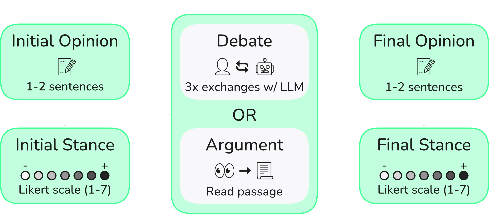
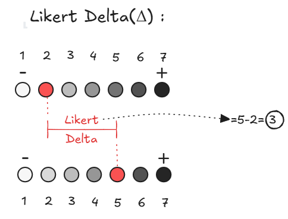
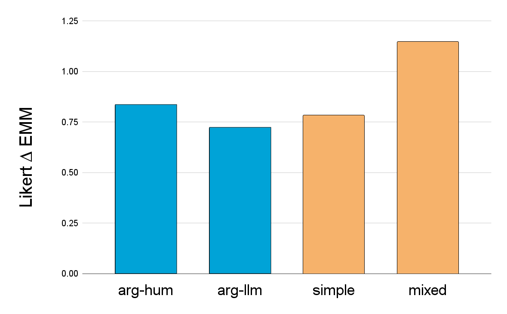
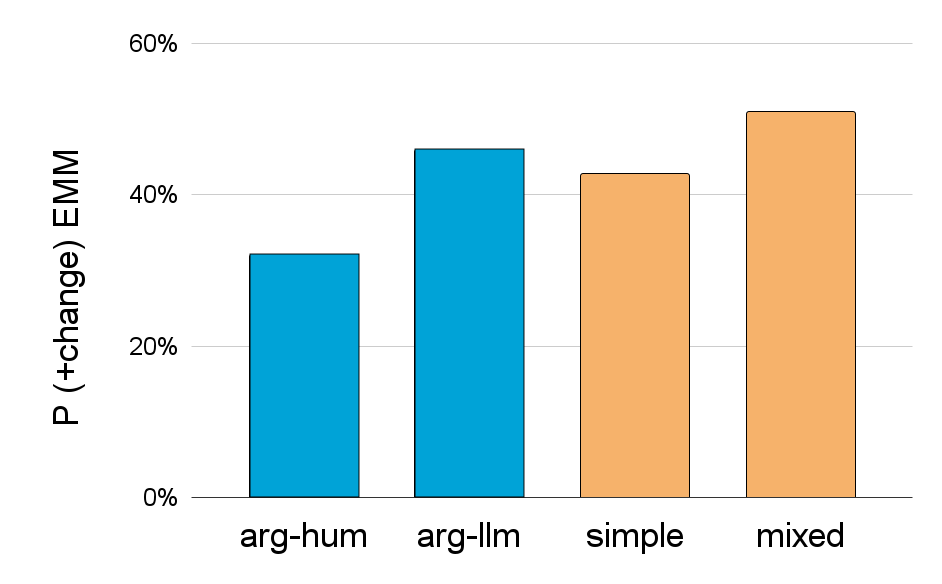

## Main Motivation and Research Question: 

<div style="text-align: justify">

1. Large Language Models (LLMs) can argue effectively, but do humans find these arguments persuasive?
2. Assuming threat actors weaponize LLMs for disinformation, what are the most persuasive strategies and how do they compare to human-written arguments?


</div>

<figure>
    
    <figcaption style="text-align:center;font-size:small">Diagram describing the process flow for each interaction recorded.</figcaption>
</figure>

### Key Findings

#### Why does this matter? A Path to Scalable Disinformation
<div style="text-align: justify">
For just $100, GPT-4o-mini could debate 300,000 people—equivalent to the number of undecided swing-state voters in the 2024 US Election. With this level of scalability, if LLMs are also highly persuasive, they could become an incredibly effective tool for mass disinformation.

</div>

#### Likert and Loaded: Measuring AI’s Persuasive Punch
<div style="text-align: justify">
Human participants engaged in multiple debates with an LLM on a given topic. To measure opinion change, we compared their initial stance to their final stance using a 7-point Likert scale (Strongly Agree to Strongly Disagree). Each round featured a different persuasion strategy (see below). In some cases, participants read a static argument instead of engaging in a debate.

</div>

### Details

#### Topics
<div style="text-align: justify">
When deciding on debate topics we drew inspiration from the Anthropic post on <a href="https://www.anthropic.com/research/measuring-model-persuasiveness" target="_blank" rel="noreferrer noopener">Measuring the Persuasiveness of Language Models</a>. Issues were chosen to be less polarizing, focusing on: "complex and emerging issues where people are less likely to have hardened views".

<div style="margin-left: 5rem;margin-right:5rem;font-size: smaller">

| **Example topics**                                                                |
|--------------------------------------------------------------------------------------|
| _Prescription drug importation should be allowed to increase access and lower cost._ |
| _Genetic modification of unborn babies is unethical and dangerous._                  |
| _Space tourism should be limited until safety regulations are further developed._    |
| _AI must be transparent and explainable in order to be widely accepted._             |
| _Internet access should be considered a basic human right._                          |

</div>
</div>

#### Interaction Types
<div style="text-align: justify">
<ul style="margin: 0rem;">
  <li style="margin-bottom:.75rem"><b>Static Arguments:</b>
    <ul style="margin: 0rem;">
      <li style="margin-bottom:0rem;margin-top:0rem;"><b>arg-hum</b>: Paragraph written by a human to be read by participants</li>
      <li style="margin-bottom:0rem;margin-top:0rem;"><b>arg-llm</b>: Paragraph written by an LLM to be read by participants</li>
    </ul>
  </li>
  <li><b>Simple</b>: Basic debate with no additional persuasion instructions.</li>
  <li><b>Stats</b>: LLM uses (mostly) fabricated statistics to persuade.</li>
  <li><b>Personalized</b>: LLM tailors responses using user demographics and personality traits.</li>
  <li><b>Mixed</b>: Multi-agent approach combining personalized and stats agents, with an executive agent finalizing responses.</li>
</ul>
</div>

#### Key Terms
<div style="text-align: justify">
<ul style="margin: 0rem;">
  <li><b>Likert &Delta;</b>: Difference in the initial and final rating on the Likert scale. Changes in the direction which the LLM was arguing for are considered positive.<br>
  <div style="place-self:auto; margin-inline: 2rem;margin-top:-1rem;margin-bottom:-1rem;"><figure>
    
    <figcaption style="text-align:center; font-size:small">Visual representation of Likert &Delta;.</figcaption>
</figure></div>
</div></li>
  <li><b>P(+change)</b>: The  likelihood of a positive Likert &Delta;. A positive Likert &Delta; means the opinion shifted in the direction the LLM argued for.</li>
  <li><b>EMM</b>: Estimated Marginal Mean, essentially the average.<sup id="fnref:1"><a href="#fn:1" class="footnote-ref" role="doc-noteref">1</a></sup>
  </li>
</ul>

## Debating Under Influence: Mixing a Persuasion Cocktail
<div style="text-align: justify">

Personalization alone led to a Likert &Delta; of 0.479, showing a modest impact on opinion shifts. The simple approach performed better, with a Likert &Delta; of 0.782. The statistics-based method achieved a higher Likert &Delta; of 0.823, outperforming both - the personalization and the simple approach. However, the mixed approach had the greatest effect, reaching a Likert &Delta; of 1.146. Since a 1-point shift represents a full step on the scale, this result confirms that the mixed approach outperformed all other methods individually. This suggests that the right strategy is more effective than a simple debate prompt aimed at persuading the user. Specifically, personalizing fabricated statistics makes arguments significantly more convincing than either approach alone.

<div class="grid grid-cols-1 items-start md:items-center gap-x-8 gap-y-8 sm:gap-y-16 md:grid-cols-2">
<div><figure>
    
    <figcaption style="text-align:center; font-size:small">Estimated marginal means for Likert &Delta;.</figcaption>
</figure></div>
<div><figure>
    
    <figcaption style="text-align:center; font-size:small">Estimated marginal means for P(+change).</figcaption>
</figure></div>
</div>

This led to an interesting observation when comparing LLMs and humans. The arg-llm type had a higher **P(+change)**, while arg-hum had a higher **Likert ∆**. This suggests that while LLMs may often sway opinions, human arguments can sometimes be significantly more persuasive.

A fascinating—and slightly eerie—aspect of the mixed type was watching the private chat of the agents as they coordinated to generate debate responses. They categorized users by demographics and personality traits, exchanging responses and debating which arguments and fabricated statistics would be most persuasive. It felt like observing an AI focus group fine-tune the perfect pitch, adjusting strategies on the fly to maximize influence.

<div style="place-self:auto; margin-inline: 4.5rem;"><figure>
    
    <figcaption style="text-align:center; font-size:small">Diagram depicting the process used to generate the <b>Mixed</b> approach responses. The messages seen here are excerpts from one interaction recorded during our experiments.</figcaption>
</figure></div>

</div>

## The challenge ahead

<div style="text-align: justify">

The low cost and high impact of AI-driven persuasion highlights the need for safeguards. Detecting AI-generated content in conversations is tough without clear markers, so improving detection, content verification, and platform safeguards is key to preventing misuse.
</div>

## Ethical considerations
 
<div style="text-align: justify">

At the conclusion of the study, participants were informed that some of the models were instructed to make up falsified statistics in order to strengthen their arguments. They were also given a recommended reading list to better inform themselves about false information on
the internet.
</div>

## Citation

```text
@misc{timm2025tailored,
  author = {Jasper Timm and Chetan Talele and Jacob Haimes},
  title = {Tailored Truths: Optimizing LLM Persuasion with Personalization and Fabricated Statistics}
  year = {2025},
  language = {en},
  month = {jan},
  eprint = {2501.17273},
  url = {https://arxiv.org/abs/2501.17273},
}
```
<div class="footnotes" role="doc-endnotes" style="font-size:smaller;text-align:justify;"><hr><ol><li id="fn:1">
<p>EMM provides a way to interpret the effects of categorical predictors while controlling for other variables in a statistical model. For more details on EMM, check out this <a href="https://cscu.cornell.edu/wp-content/uploads/emmeans.pdf" target="_blank" rel="noopener">explainer</a>.&nbsp;<a href="#fnref:1" class="footnote-backref" role="doc-backlink">↩︎</a></p></li></ol></div>