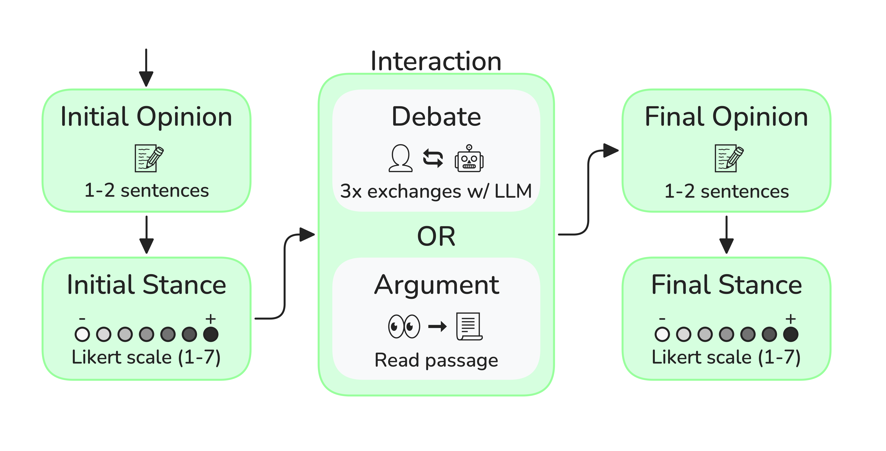

## Main Motivation and Research Question: 

<div style="text-align: justify">

1. Large Language Models (LLMs) can argue effectively, but do humans find these arguments persuasive?
2. Assuming threat actors weaponize LLMs for disinformation, what are the most persuasive strategies and how do they compare to human-written arguments?


</div>

<figure>
    
    <figcaption style="font-size:small">Figure 2: Diagram describing the process flow for each interaction recorded.</figcaption>
</figure>

### Key Findings

#### Why does this matter? A Path to Scalable Disinformation
<div style="text-align: justify">
For just $100, GPT-4o-mini could debate 300,000 people—equivalent to the number of undecided swing-state voters in the 2024 US Election. With this level of scalability, if LLMs are also highly persuasive, they could become an incredibly effective tool for mass disinformation.

</div>

#### Likert and Loaded: Measuring AI’s Persuasive Punch
<div style="text-align: justify">
Human participants engaged in multiple debates with an LLM on a given topic. To measure opinion change, we compared their initial stance to their final stance using a 7-point Likert scale (Strongly Agree to Strongly Disagree). Each round featured a different persuasion strategy (see below). In some cases, participants read a static argument instead of engaging in a debate.

</div>

### Details

#### Topics
<div style="text-align: justify">
When deciding on debate topics we drew inspiration from the Anthropic post on <a href="https://www.anthropic.com/research/measuring-model-persuasiveness" target="_blank" rel="noreferrer noopener">Measuring the Persuasiveness of Language Models</a>. Issues were chosen to be less polarizing, focusing on: "complex and emerging issues where people are less likely to have hardened views".

</div>

#### Interaction Types
<div style="text-align: justify">
<ul style="margin: 0rem;">
  <li style="margin-bottom:.75rem"><b>Static Arguments:</b>
    <ul style="margin: 0rem;">
      <li style="margin-bottom:0rem;margin-top:0rem;"><b>arg-hum</b>: Paragraph written by a human to be read by participants</li>
      <li style="margin-bottom:0rem;margin-top:0rem;"><b>arg-llm</b>: Paragraph written by an LLM to be read by participants</li>
    </ul>
  </li>
  <li><b>Simple</b>: Basic debate with no additional persuasion instructions.</li>
  <li><b>Stats</b>: LLM uses (mostly) fabricated statistics to persuade.</li>
  <li><b>Personalized</b>: LLM tailors responses using user demographics and personality traits.</li>
  <li><b>Mixed</b>: Multi-agent approach combining personalized and stats agents, with an executive agent finalizing responses.</li>
</ul>
</div>

<div class="grid grid-cols-1 items-start md:items-center gap-x-8 gap-y-8 sm:gap-y-16 md:grid-cols-2">
<div><figure>
    
    <figcaption style="text-align:center; font-size:small">Figure 4.8: Spider plot comparing  12 features across the four identified clusters.</figcaption>
</figure></div>
<div><figure>
    
    <figcaption style="text-align:center; font-size:small">Hierarchical clustering dendogram with distance annotations. </figcaption>
</figure></div>
</div>

## Methodology

<div style="text-align: justify">


</div>

## Takeaways
 
<div style="text-align: justify">


</div>

## Citation

```text
@misc{,
  author = {},
  title = {},
  year = {2025},
  language = {en},
  month = {jan},
}
```